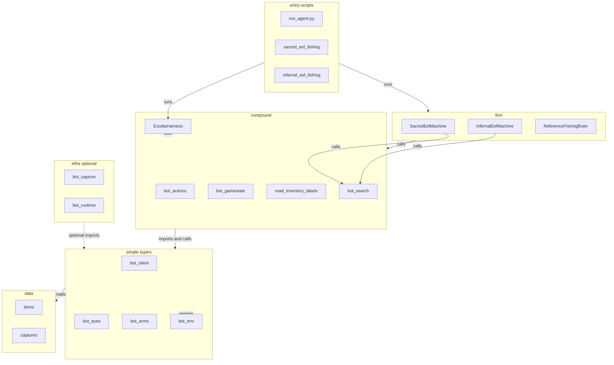

# Exodia file inventory

Living reference for **what exists**, **how files connect** (imports, runs, assets), and **usage status** (~5 min read, ~85 Python paths). Update when you add, move, or remove files.

**Companion:** [`FUNCTIONS.md`](FUNCTIONS.md) owns **call** edges (function pipelines, recipes). **Together** the two docs define a shared layer model so you can construct a full project graph.

---

## 1. How to read this doc

### Graph model (shared with FUNCTIONS.md)

| Node kind | Defined in | Example |
|-----------|------------|---------|
| **Layer** | Both docs (IDs below) | `compound`, `simple-eyes` |
| **File** | FILES §4 | `bot_eyes.py`, `SacredEelFishing/sacred_eel_fsm.py` |
| **Function** | FUNCTIONS §4–§5 | `read_inventory_labels`, `ExodiaHarness.step` |
| **Entry** | FILES §3 | `run_agent.py`, `run_sacred_eel.sh` |
| **Asset** | FILES §5 | `items/`, `captures/` |

| Edge | Meaning | Primary source |
|------|---------|----------------|
| **`imports`** | Python `import` / `from … import` | FILES §4 “Imported by” |
| **`calls`** | Runtime function invocation | FUNCTIONS §2 recipes, §5 pipelines |
| **`runs`** | Shell/CLI → script | FILES §3 |
| **`reads`** | Runtime file I/O (templates, JSON logs) | FILES §5 |

**Construct the full graph:**

1. **FILES §4** — map each file to a **Layer**; draw **`imports`** (importer → importee) from “Imported by”.
2. **FUNCTIONS §5** — add **`calls`** from compound pipelines (e.g. `bot_inventory_items.read_inventory_labels` → `bind_inventory_to_eyes`).
3. **FILES §3** — attach **`runs`** from shell/CLI to entry files.
4. **FILES §5** — attach **`reads`** from modules to asset dirs.

Call edges and pipelines: [`FUNCTIONS.md`](FUNCTIONS.md) §5.

### Canonical layer IDs

| Layer ID | Files (typical) | FUNCTIONS home |
|----------|-----------------|----------------|
| `entry-scripts` | `run_agent.py`, `*_fishing.py`, tooling CLIs | §8 entrypoints |
| `entry-legacy` | `legacyCode/*` | §6 deprecated |
| `entry-tests` | `tests/*_test.py`, `tests/run_tests.py` | §5 integration table |
| `fsm` | `*_fsm.py`, `agents/*_brain.py` | §5 FSM tick |
| `compound` | `bot_actions`, `bot_gamestate`, `bot_inventory_items`, `bot_search`, `bot_action_ui`, `bot_harness`, `bot_world_objects` | §5 compound |
| `simple-client` | `bot_client`, `bot_client_config`, `window_tool` | §4 Client |
| `simple-eyes` | `bot_eyes`, `bot_inventory_detect`, `bot_inventory_count`, `bot_match_index`, `bot_spot_verify` | §4 Eyes / detect / match / spot |
| `simple-arms` | `bot_arms`, `bot_inventory_actions` | §4 Arms / inv actions |
| `simple-env` | `bot_env`, `constants`, `BasicUtils` | §4 Environment |
| `infra` | `bot_capture`, `bot_stream`, `bot_track`, `bot_runtime`, `bot_overlay`, `bot_session*`, `bot_action_log`, `bot_verify`, `bot_frames`, `bot_legs`, `bot_calibration`, `bot_perception_status`, `bot_wait` | §7 diag/infra |
| `external-ui` | `ExodiaBotUI/` | §7 (note only) |
| `data` | `items/`, `captures/`, `logs/`, `client_rect.json` | §10 env + FILES §5 |

### Status legend

| Status | Meaning |
|--------|---------|
| `active` | Imported by production or shared library code |
| `entry` | Run directly (`__main__`, shell, or `python -m`) |
| `entry+imported` | Both CLI and library import |
| `test-only` | Used only under `tests/` |
| `legacy` | Historical example; `legacyCode/` |
| `infra-optional` | Wired via flags (`--stream`, `--overlay`, `--session`) |
| `unused` | No importers, no entry, no shell ref |

**Canonical entrypoints:** `run_agent.py`, `SacredEelFishing/`, `InfernalEelFishing/` — not `legacyCode/`.

---

## 2. Project graph (composed)

Call-flow slice in [`FUNCTIONS.md`](FUNCTIONS.md) §1; this diagram adds **file nodes**, **import/run/read** context, and **infra**.

### Import spine (highest-traffic edges)

Full per-file edges in §4. These rows validate the graph without listing all paths.

| Importer | Importee | Layer hop |
|----------|----------|-----------|
| `SacredEelFishing/sacred_eel_fsm.py` | `bot_search`, `bot_actions`, `bot_action_ui` | fsm → compound |
| `InfernalEelFishing/infernal_eel_fsm.py` | `bot_search`, `bot_inventory_actions`, `bot_inventory_items` | fsm → compound |
| `run_agent.py` | `bot_harness`, `bot_capture`, `bot_legs`, `agents.reference_fishing_brain` | entry → compound/fsm/infra |
| `bot_harness.py` | `bot_gamestate`, `bot_actions`, `bot_capture`, `bot_verify` | compound → compound/simple/infra |
| `bot_actions.py` | `bot_client`, `bot_eyes`, `bot_arms`, `bot_env` | compound → simple |
| `bot_gamestate.py` | `bot_inventory_items`, `bot_action_ui`, `bot_eyes` | compound → compound/simple |
| `bot_inventory_items.py` | `bot_inventory_detect`, `bot_match_index`, `bot_eyes` | compound → simple |
| `bot_inventory_detect.py` | `bot_eyes`, `bot_inventory_count` | simple → simple |
| `bot_world_objects.py` | `bot_spot_verify`, `bot_search`, `bot_inventory_detect` | compound → simple |
| `bot_spot_verify.py` | `bot_eyes`, `bot_search` | simple → simple |
| `bot_capture.py` | `bot_track`, `bot_env`, `constants` | infra → infra/simple |
| `SacredEelFishing/sacred_eel_fishing.py` | `bot_runtime`, `bot_session_events`, `bot_spot_verify` | entry → infra/compound |
| `InfernalEelFishing/infernal_eel_fishing.py` | `bot_runtime`, `bot_inventory_detect`, `bot_gamestate` | entry → infra/compound |
| `agents/reference_fishing_brain.py` | `bot_harness` | fsm → compound |
| `legacyCode/agility.py` | `bot_actions`, `BasicUtils` | entry-legacy → compound |

---

## 3. Canonical entrypoints

| Path | How to run | Graph role |
|------|------------|------------|
| [`run_agent.py`](run_agent.py) | `python run_agent.py --brain reference_fishing` | `runs` → harness + agent |
| [`SacredEelFishing/sacred_eel_fishing.py`](SacredEelFishing/sacred_eel_fishing.py) | `./SacredEelFishing/run_sacred_eel.sh` or `python -m SacredEelFishing.sacred_eel_fishing` | `runs` → sacred FSM session |
| [`InfernalEelFishing/infernal_eel_fishing.py`](InfernalEelFishing/infernal_eel_fishing.py) | `./InfernalEelFishing/run_infernal_eel.sh` or `python -m InfernalEelFishing.infernal_eel_fishing` | `runs` → infernal FSM session |
| [`run_sacred_eel.sh`](run_sacred_eel.sh) | Delegates to package script | `runs` → sacred entry |
| [`run_infernal_eel.sh`](run_infernal_eel.sh) | Delegates to package script | `runs` → infernal entry |

### Tooling / diagnose CLIs

| Path | How to run | Graph role |
|------|------------|------------|
| [`calibrate_client_rect.py`](calibrate_client_rect.py) | `python calibrate_client_rect.py` | `runs` → client geometry |
| [`capture_runelite_once.py`](capture_runelite_once.py) | `python capture_runelite_once.py` | `runs` → one-shot capture |
| [`label_inventory_item.py`](label_inventory_item.py) | `python label_inventory_item.py` | `runs` → item labeling |
| [`exodia_ctl.py`](exodia_ctl.py) | `python exodia_ctl.py <cmd>` | `runs` → runtime control |
| [`session_report.py`](session_report.py) | `python session_report.py …` | `runs` → JSONL summary |
| [`SacredEelFishing/sacred_eel_report.py`](SacredEelFishing/sacred_eel_report.py) | `python -m SacredEelFishing.sacred_eel_report` | `runs` → eel event report |
| [`SacredEelFishing/sacred_eel_diagnose.py`](SacredEelFishing/sacred_eel_diagnose.py) | `./run_sacred_eel.sh diagnose` (lazy import) | `runs` → perception probe |
| [`InfernalEelFishing/infernal_eel_diagnose.py`](InfernalEelFishing/infernal_eel_diagnose.py) | `./run_infernal_eel.sh diagnose` (lazy import) | `runs` → perception probe |
| [`bot_match_index.py`](bot_match_index.py) | `python -m bot_match_index cleanup …` | `runs` → fingerprint cleanup CLI |

Lazy diagnose: fishing scripts import `*_diagnose` only on the `diagnose` subcommand.

---

## 4. File inventory by category

Columns: **Path** | **Layer** | **Status** | **Imported by** | **Role** | **FUNCTIONS**

### 4a Production core — root modules

| Path | Layer | Status | Imported by | Role | FUNCTIONS |
|------|-------|--------|-------------|------|-----------|
| `bot_actions.py` | compound | entry+imported | FSMs, diagnose, harness, legacy | Init/update/click glue | §5 Glue |
| `bot_arms.py` | simple-arms | active | `bot_actions`, FSMs, `bot_inventory_actions`, harness | Mouse/keys/pan | §4 Arms |
| `bot_client.py` | simple-client | active | `bot_actions`, FSMs, fishing, diagnose | Window rect | §4 Client |
| `bot_client_config.py` | simple-client | active | fishing, calibrate, tests, `run_agent` | `client_rect.json` | §4 Client |
| `bot_env.py` | simple-env | active | eyes, arms, client, capture (15 importers) | Capture/input backends | §4 Environment |
| `bot_eyes.py` | simple-eyes | entry+imported | 23 importers across stack | Vision + capture on frame | §4 Eyes |
| `bot_gamestate.py` | compound | active | harness, FSMs, diagnose, tests | `GameState` builder | §5 `build_game_state` |
| `bot_harness.py` | compound | active | `run_agent`, tests, reference brain | Agent tick loop | §5 Harness tick |
| `bot_inventory_actions.py` | simple-arms | active | infernal FSM, `bot_actions`, tests | Slot clicks, use-on | §4 Inventory actions |
| `bot_inventory_count.py` | simple-eyes | active | detect, items, match_index, sacred diagnose | Match helpers; diagnose counts | §4 (diagnose-only) |
| `bot_inventory_detect.py` | simple-eyes | active | items, fishing, tests, world_objects | Panel binding | §5 panel binding |
| `bot_inventory_items.py` | compound | active | FSMs, fishing, gamestate, labeler, tests | Slot identity, `read_inventory_labels` | §5 inventory read |
| `bot_match_index.py` | simple-eyes | entry+imported | `bot_inventory_items` | Templates/fingerprints | §4 Match index |
| `bot_action_ui.py` | compound | active | FSMs, gamestate, tests | Action strip predicates | §4 Action strip |
| `bot_wait.py` | infra | active | `bot_action_ui`, tests | `poll_until` | §4 Wait |
| `bot_search.py` | compound | active | FSMs, spot_verify, arms, stream, track | Camera pan / ROI | §5 spot seek |
| `bot_spot_verify.py` | simple-eyes | active | sacred fishing/diagnose, world_objects, tests | Cyan + eel verify | §4 Spot verify |
| `bot_perception_status.py` | infra | active | fishing scripts, runtime test | Runtime status JSON | §7 |
| `bot_world_objects.py` | compound | test-only | `tests/bot_world_detect_test.py` | World detect (not in FSM) | §2.10, §5 world objects |
| `constants.py` | simple-env | active | env, harness, FSMs, capture, BasicUtils | Shared constants | §4 |
| `BasicUtils.py` | simple-env | active | `legacyCode/agility.py` only | `wait_ticks` helper | §4 (legacy consumer) |

### 4b Tooling / infra

| Path | Layer | Status | Imported by | Role | FUNCTIONS |
|------|-------|--------|-------------|------|-----------|
| `bot_capture.py` | infra | infra-optional | env, harness, stream, `run_agent` | Capture pipeline | §7 |
| `bot_stream.py` | infra | infra-optional | harness, `run_agent`, stream test | MJPEG HTTP | §7 |
| `bot_track.py` | infra | infra-optional | capture, stream, tests | Blob motion v1 | §7, §9 |
| `bot_runtime.py` | infra | entry+imported | fishing scripts, `exodia_ctl`, tests | JSON control/status | §7 |
| `bot_session_events.py` | infra | active | fishing, runtime, session_report, tests | Session JSONL | §7 |
| `bot_overlay.py` | infra | infra-optional | fishing `--overlay`, diagnose | Live debug overlay | §7 |
| `bot_frames.py` | infra | active | overlay, session, capture_runelite, tests | PNG sidecars | §7 |
| `bot_session.py` | infra | infra-optional | harness, `run_agent` | `--session` replay | §7 |
| `bot_action_log.py` | infra | active | harness, `run_agent`, tests | JSONL action log | §7 |
| `bot_verify.py` | infra | active | harness, tests | Post-action verify | §7 |
| `bot_calibration.py` | infra | active | `run_agent` | Startup health checks | §7 |
| `bot_legs.py` | infra | active | `run_agent`, legacy | Timed outer loop | §8 `run_agent` |
| `window_tool.py` | simple-client | active | client, fishing, smoke_brain | Linux window helpers | README |
| `roi_picker.py` | simple-client | active | `calibrate_client_rect` | ROI picker UI | §7 |
| `calibrate_client_rect.py` | entry-scripts | entry+imported | fishing (lazy), shell comments | Client rect CLI | §7 |
| `capture_runelite_once.py` | entry-scripts | entry | — | One-shot capture | §7 |
| `label_inventory_item.py` | entry-scripts | entry | — | Interactive labeling | §8 |
| `exodia_ctl.py` | entry-scripts | entry | — | Runtime control CLI | §7 |
| `session_report.py` | entry-scripts | entry+imported | sacred_eel_report, tests | Event summarizer | §7 |

### 4c Packages — SacredEelFishing

| Path | Layer | Status | Imported by | Role | FUNCTIONS |
|------|-------|--------|-------------|------|-----------|
| `SacredEelFishing/sacred_eel_fishing.py` | entry-scripts | entry | — (shell `-m`) | Session loop | §8, §11 |
| `SacredEelFishing/sacred_eel_fsm.py` | fsm | active | fishing, diagnose, tests | `SacredEelMachine` | §5 FSM tick |
| `SacredEelFishing/sacred_eel_log.py` | infra | active | fishing, fsm, diagnose, report, runtime | Run logging | §7 |
| `SacredEelFishing/sacred_eel_progress.py` | infra | active | fsm, tests | Stagnation scoring | §7 |
| `SacredEelFishing/sacred_eel_diagnose.py` | entry-scripts | entry | fishing (lazy `diagnose`) | Health probe | §7 |
| `SacredEelFishing/sacred_eel_report.py` | entry-scripts | entry | — | Session report CLI | §7 |
| `SacredEelFishing/__init__.py` | fsm | active | runtime, tests | Package marker | — |

### 4c Packages — InfernalEelFishing

| Path | Layer | Status | Imported by | Role | FUNCTIONS |
|------|-------|--------|-------------|------|-----------|
| `InfernalEelFishing/infernal_eel_fishing.py` | entry-scripts | entry+imported | `legacyCode/infernal_fishing` | Session loop | §8, §11 |
| `InfernalEelFishing/infernal_eel_fsm.py` | fsm | active | fishing, diagnose | `InfernalEelMachine` | §5 FSM tick |
| `InfernalEelFishing/infernal_eel_log.py` | infra | active | fishing, fsm, diagnose, legacy shim | Run logging | §7 |
| `InfernalEelFishing/infernal_eel_progress.py` | infra | active | fsm | Stagnation scoring | §7 |
| `InfernalEelFishing/infernal_eel_diagnose.py` | entry-scripts | entry | fishing (lazy `diagnose`) | Health probe | §7 |
| `InfernalEelFishing/__init__.py` | fsm | active | `legacyCode/infernal_fishing` | Package marker | — |

### 4d Agents

| Path | Layer | Status | Imported by | Role | FUNCTIONS |
|------|-------|--------|-------------|------|-----------|
| `agents/reference_fishing_brain.py` | fsm | active | `run_agent`, harness test | Reference policy | §8 |
| `agents/__init__.py` | fsm | active | `run_agent`, harness test | Package marker | — |

### 4e Legacy — `legacyCode/`

| Path | Layer | Status | Imported by | Role | FUNCTIONS |
|------|-------|--------|-------------|------|-----------|
| `legacyCode/agility.py` | entry-legacy | legacy, entry | — | Color agility example | §8 legacy |
| `legacyCode/WhyFletch.py` | entry-legacy | legacy, entry | — | Fixed-coord fletch | §6 deprecated paths |
| `legacyCode/infernal_fishing.py` | entry-legacy | legacy, entry | — | Redirect to infernal package | §6 |
| `legacyCode/README.md` | entry-legacy | — | — | Run instructions | — |

Deprecated *functions*: [`FUNCTIONS.md`](FUNCTIONS.md) §6.

### 4f Tests — `tests/`

| Path | Layer | Status | Imported by | Role | FUNCTIONS |
|------|-------|--------|-------------|------|-----------|
| `tests/inventory_test_common.py` | entry-tests | active | inventory/world/use-on tests, labeler | Shared capture helpers | §5 integration |
| `tests/__init__.py` | entry-tests | active | integration tests | Path bootstrap | — |
| `tests/run_tests.py` | entry-tests | entry | — | Offline unittest runner | — |
| `tests/bot_inventory_test.py` | entry-tests | entry | — | Inventory eyes suite | §5, §8 |
| `tests/bot_inventory_arms_test.py` | entry-tests | entry | — | Drag + occupancy | §5, §8 |
| `tests/bot_inventory_use_on_test.py` | entry-tests | entry | — | Use-on live test | §5, §8 |
| `tests/bot_world_detect_test.py` | entry-tests | entry | — | World detect suite | §2.10, §8 |
| `tests/bot_harness_test.py` | entry-tests | entry | — | Harness unit tests | §5 |
| `tests/bot_*_test.py` (others) | entry-tests | entry | — | Module unit tests | — |
| `tests/test_stream_live.py` | entry-tests | entry | — | MJPEG live test | §7 |
| `tests/manual/smoke_*.py` | entry-tests | entry | — | Manual smoke scripts | — |

### 4g External UI — `ExodiaBotUI/`

| Path | Layer | Status | Imported by | Role | FUNCTIONS |
|------|-------|--------|-------------|------|-----------|
| `ExodiaBotUI/` | external-ui | — | — (no Python imports) | Phase 0 Electron shell; settings, script browser | §7 note |

See [`ExodiaBotUI/README.md`](ExodiaBotUI/README.md). **Graph hole:** disconnected from bot execution today (Python smoke test only).

---

## 5. Non-Python assets

| Path | Edge | Used by |
|------|------|---------|
| `items/*.png` | `reads` | `bot_match_index`, `bot_inventory_items` |
| `items/fingerprints/*.json` | `reads` | `bot_match_index` seen-item registry |
| `captures/` (templates, overlays) | `reads` | detect, spot verify, tests; overlays gitignored |
| `client_rect.json` | `reads` | `bot_client_config` |
| `logs/` | `reads` / `writes` | runtime, session events, action logs |
| `tests/fixtures/inventory/` | `reads` | offline inventory tests |
| `SacredEelFishing/run_sacred_eel.sh` | `runs` | sacred entry |
| `InfernalEelFishing/run_infernal_eel.sh` | `runs` | infernal entry |

Not inventoried: `PlansTODO/` (planning only), `.venv/` / `exodia/` venv trees, `items/fingerprints/` per-file JSON listing.

---

## 6. Known gaps (graph holes)

Mirrors [`FUNCTIONS.md`](FUNCTIONS.md) §9:

- **`bot_world_objects`** — test-only branch; not wired into infernal FSM.
- **`bot_track`** — infra optional; experimental, not spot seek.
- **`ExodiaBotUI`** — disconnected node; no bot spawn yet.
- **`GameState`** — no per-slot item labels on dataclass (labels on `perception_envelope` only).
- **`SacredEelStepper`** — planned; fishing still uses bespoke poll loops.

---

## 7. Maintenance

- Update **FILES** when files, layers, or **imports** change.
- Update **FUNCTIONS** when **call** stacks or recipes change.
- Keep **layer IDs** identical in both docs.
- Optional v2: `scripts/file_usage_survey.py` to regenerate import counts (call edges stay manual in FUNCTIONS).

---

*Last reviewed: post `legacyCode/` move — shared graph model with FUNCTIONS.md; 85 project `.py` files (excl. venv).*
