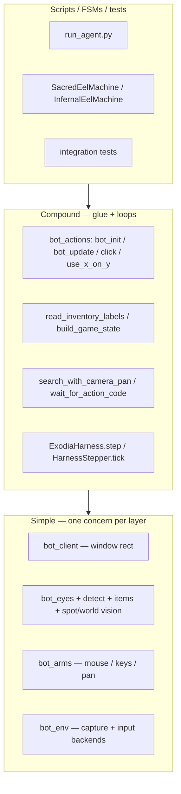

# Exodia function guide

Living reference for how automation is layered in this repo (~10 min read, ~80 supported symbols). Update when you add or remove public building blocks.

---

## 1. How to read this doc

- **Simple** functions do one thing in one layer (geometry, capture, vision-only, or input-only). **Compound** functions orchestrate two or more layers or run a multi-step loop.
- Tables use a **Question** column: if that question matches your task, the function is a likely entry point.
- **Call stacks** in recipes and compound sections read top-to-bottom (caller → callee). Indentation shows sub-steps.
- **Not listed:** private `_`-prefixed helpers, debug overlay drawers (unless you are diagnosing), and `BrainCommand` dataclass fields (see `bot_harness.py` docstrings).
- **Canonical paths:** production bots use `run_agent.py`, package FSMs (`SacredEelFishing/`, `InfernalEelFishing/`), and harness wiring — not `legacyCode/` scripts.
- **Project graph:** layer IDs here match [`FILES.md`](FILES.md). **Call** edges (this doc) + **import/run/read** edges ([`FILES.md` §2](FILES.md)) compose the full graph.
- **File inventory:** paths, importers, entrypoints → [`FILES.md`](FILES.md).

*Call-flow view below; see [`FILES.md` §2](FILES.md) for file + import composition.*



---

## 2. Recipes (“I want to…”)

### 1. Wire client, eyes, and arms for any script

1. `bot_actions.bot_init(win_rect=…)` → `[client, eyes, arms]`
2. `client.update()` or `FixedClientWindow` (geometry already on `client.win_rect`)
3. `eyes.setRect(client.win_rect)` — done inside `bot_init`

### 2. Refresh window geometry and grab the latest frame

1. `bot_actions.bot_update(client, eyes)`
2. `bot_actions.sync_window(client, eyes)` — geometry only, no grab
3. `eyes.capture_frame()` — grab only (after rect is set)

### 3. Know what is in my inventory (labels + occupancy)

1. `bot_actions.bot_update(client, eyes)` or `eyes.capture_frame()` (fresh `eyes.curr_client`)
2. `bot_inventory_detect.bind_inventory_to_eyes(eyes)` **or** `bot_inventory_items.read_inventory_labels(eyes)` — **compound** (labels path auto-binds when `inventory_rect` is missing)
3. `bot_inventory_items.count_labeled_item_slots(slot_items, occupancy, "infernal_eel")` (after `read_inventory_labels`)

Grid is **7 rows × 4 columns** (`INV_ROWS=7`, `INV_COLS=4`, 28 slots). Row 0 is top; col 0 is left.

### 4. Use a named inventory item on another (closest dest)

1. `read_inventory_labels(eyes)`
2. `bot_inventory_actions.use_named_item_on_named_item(eyes, arms, "hammer", "infernal_eel")` — **compound**
3. Internally: `slots_matching_item` → `closest_slot` → `clear_inventory_hover` → `use_inventory_slot_on_slot`

Template fallback (PNG filenames, not `items/` stems): `bot_actions.use_x_on_y(eyes, arms, source, dest, client=client)`.

### 5. Click a world template (outside inventory)

1. `bot_actions.click_on_image(client, arms, eyes, "infernal_eel_spot.png")` — **compound**
2. `eyes.locate_image(filename=…, inv=False)` → random hit
3. `arms.click_at(point)`

### 6. Click a color highlight (agility-style)

1. `bot_actions.click_on_color(client, arms, eyes, bgr_color, shade=20, range=20)`
2. `eyes.locate_cluster(…)` → `arms.click_at`
3. Wait: `BasicUtils.wait_ticks(n, jitter)`; confirm: `bot_actions.check_color(client, eyes, next_color)`

### 7. Find a fishing spot when it is off-screen (camera pan + optional walk)

1. `bot_spot_verify.locate_sacred_eel_spots(…)` or FSM `_locate_spots` / `_locate_sacred_eels` — **compound**
2. `bot_search.search_with_camera_pan(locate, pan, max_pan_attempts=…, relocate=…)` — **compound**
3. `bot_search.click_random_hit(candidates, arms.click_at)` or direct `arms.click_at`
4. `bot_action_ui.wait_for_action_code(lambda: eyes.get_action_text(refresh=False), …)` — **compound**

Infernal seek uses template peaks in playspace (`InfernalEelMachine` + `search_with_camera_pan`); sacred seek adds eel-icon + cyan verification (`locate_sacred_eel_spots`).

### 8. Run one agent harness tick

1. `bot_harness.create_harness(brain=…)` → `ExodiaHarness`
2. `harness.step(refresh=True)` — **compound**: `refresh_geometry` → `observe` → `brain.decide` → `apply_commands` → verify → log
3. From `BotLegs`: `HarnessStepper(harness).tick()` (each legs cycle calls `harness.step`)

### 9. Build observation / game state for logs or agents

1. `harness.refresh_geometry()` or `bot_update`
2. `bot_gamestate.build_game_state(eyes, tick)` — **compound** (action OCR + `read_inventory_labels`)
3. Labels on `eyes.perception_envelope["inventory_slot_items"]` (flat envelope on `BotEyes`; stream `/meta` uses nested `perception.inventory` / `perception.world` — applied via `apply_stream_snapshot_to_eyes`)
4. `GameState` carries occupancy count, not per-slot names yet
5. `bot_gamestate.game_state_to_dict(state)` for JSON/meta

### 10. Detect world objects (cyan marker → icon template)

1. `bot_world_objects.locate_world_objects_from_eyes(eyes)` — **compound** (capture + ROI + cyan path)
2. Cyan blobs: `bot_spot_verify.locate_cyan_marker_regions` (imported by `bot_world_objects`, not defined there)
3. Debug: `draw_world_detect_overlay` → `captures/world_detect_overlay.png`

Not wired into infernal FSM yet — test/diagnose path only.

### 11. Run sacred or infernal eel fishing for one FSM tick

**Sacred:** `SacredEelMachine(ctx).step()` — states FISHING / SEEK_SPOT / SCALING; eel count via `read_inventory_labels` + `count_labeled_item_slots`.

**Infernal:** `InfernalEelMachine(ctx).step()` — states FISHING / SEEK_SPOT / CRACKING; same inventory counting; cracking via `use_named_item_on_named_item`.

Outer session loops: `SacredEelFishing/sacred_eel_fishing.py`, `InfernalEelFishing/infernal_eel_fishing.py`.

### 12. Diagnose inventory vision (no mouse)

1. Offline: `python tests/bot_inventory_test.py`
2. Live: `python tests/bot_inventory_test.py --online`
3. Pipeline: outline match → occupancy grid → `identify_inventory_slot_items` → overlay at `captures/inventory_test_overlay.png`

### 13. Run template action against stream cache

Requires perception stream running (`EXODIA_STREAM_PORT` > 0 or `exodia_perception_stream.py` / harness with stream).

1. `bot_stream_client.stream_expected()` — actions should use HTTP, not sync grab
2. `snap, err = refresh_action_frame(client, eyes)` — sync geometry + pristine BGR + `/meta` (or legacy `bot_update` when stream off)
3. `stream_snapshot_usable(snap, max_age_ms=…)` — fail with `stream_meta_stale` if too old
4. `apply_stream_snapshot_to_eyes(eyes, snap, client_rect=…)` — fills `curr_client` and flat `perception_envelope` from nested inventory/world meta (no panel mask)
5. **World click:** `hit = world_hit_for_template(snap.world, template)` when stem is in `EXODIA_WORLD_TEMPLATES` cache; else `bot_chain` live path (`locate_world_objects_from_eyes` / shape match, `perception_source=live_match`)
6. **Inventory click/identify:** use `snap.inventory` `slot_items` / `occupancy` when calibrated (`stream_cache`); else `bind_inventory_to_eyes` + live identify (`live_identify`)

Wired from ExodiaBotUI via `bot_chain` (`click_template`, `use_item_id_on_item_id`). Errors: `stream_frame_unavailable`, `stream_meta_stale`.

---

## 3. Definitions

| Term | Meaning |
|------|---------|
| **Simple** | One layer, one concern: window rect, raw capture, vision on a frame, or input at coordinates. Does not import `bot_actions`. |
| **Compound** | Combines **two or more** layers, or runs a **multi-step** loop (pan → locate → click, poll until condition, FSM tick, harness step). |

**One-question test:** *“Does this function grab the screen **and** click, or poll until UI changes?”* → **compound**. *“Does it only match templates on a BGR array I already have?”* → **simple**.

**Composition rules (short):**

- Scripts and FSMs call **compound** recipes; compounds call **simple** blocks.
- Prefer `read_inventory_labels` over re-wiring occupancy + identify.
- **`bot_eyes` owns vision** (capture, template/color match, grid geometry). **`bot_inventory_detect` composes `bot_eyes` only** — panel binding via `bind_inventory_to_eyes`; **`bot_eyes` must not import `bot_inventory_detect`**.
- Prefer `use_named_item_on_named_item` when labels exist; `use_x_on_y` for legacy PNG template names.
- `get_window_rect()` returns **bool**; read `[left, top, width, height]` from **`client.win_rect`**.
- `items_directory()` is canonical in **`bot_match_index`** (imported by `bot_inventory_items`).
- `locate_cyan_marker_regions` lives in **`bot_spot_verify`**; `bot_world_objects` imports it.

---

## 4. Simple building blocks by layer

### Client — window geometry

Find or fix the RuneLite client rectangle in screen coordinates. Everything downstream assumes `win_rect` is `[left, top, width, height]`.

| Function | Question | When to use |
|----------|----------|-------------|
| `ClientWindow.update()` | How do I refresh the HWND and rect? | Auto-tracked window; call each tick or before capture. |
| `ClientWindow.get_window_rect()` | Did geometry refresh succeed? | Returns `bool`; read rect from `client.win_rect`. |
| `FixedClientWindow` | I already know the rect (WSL / `--rect`). | Manual calibration; `get_window_rect()` always `True`. |
| `load_client_rect()` | Where is saved geometry on disk? | `client_rect.json` or `EXODIA_CLIENT_RECT_FILE`. |
| `rect_from_env()` | Is `EXODIA_CLIENT_RECT` set? | CLI/env override before `ClientWindow`. |

### Eyes — perception on client frames

Bind `BotEyes` to `client.win_rect`, capture BGR, template/color locate, action strip, inventory grid geometry. Vision-only — no clicking. **`bot_eyes` owns vision primitives**; panel binding lives in **`bot_inventory_detect`** (see §5), not here.

| Function | Question | When to use |
|----------|----------|-------------|
| `BotEyes.setRect()` | How do I bind client geometry? | Once at init; optional immediate `capture_frame()`. |
| `BotEyes.capture_frame()` / `update()` | How do I grab the latest client BGR? | Every tick before reads; fills `perception_envelope`. |
| `BotEyes.locate_image()` | Where are template peaks (points list)? | World or inv search; set `inv=True` for inventory panel. |
| `BotEyes.locate_image_detailed()` | Match scores + metadata for one template? | Spot/world pipelines needing threshold tuning. |
| `BotEyes.locate_color()` | Where are color-mask points? | Raw color hits; optional DBSCAN clustering. |
| `BotEyes.locate_cluster()` | What is the best single color cluster? | Agility highlights; `click_on_color` backend. |
| `BotEyes.get_action_text()` | Fishing UI tri-state `0/1/2`? | FSM gating; `0`=green fishing, `1`=red idle strip, `2`=hidden. |
| `BotEyes.get_action_text_with_ocr()` | Action code + OCR payload? | Harness / `build_game_state` action line text. |
| `BotEyes.ocr_action_text_roi()` | OCR on action strip only? | Diagnostics; strip text without full state build. |
| `BotEyes.ocr_dialogue_roi()` | OCR on dialogue box? | Chat/dialogue events in observations. |
| `BotEyes.compute_inventory_slot_occupancy()` | 7×4 bool occupancy grid? | Empty vs occupied; no item identity; needs `inventory_rect` set. |
| `resolve_action_strip_roi_client()` | Action-line ROI from layout? | Custom OCR or strip debug. |
| `inventory_grid_cell_xywh()` | One slot ROI inside panel? | Cropping slots for match/occupancy. |
| `inventory_slot_screen_xy()` | Screen center of slot `(row, col)`? | Mapping grid to click coordinates. |
| `analyze_inventory_panel_occupancy()` | Occupancy from cropped panel BGR? | Offline tests; panel already cropped. |

**Public vision aliases** (re-exported for `bot_inventory_detect` and tooling): `clamp_roi`, `inventory_search_roi`, `load_template_gray`, `load_template_gray_and_mask`, `match_template_peaks`, `parse_rect_env`.

### Inventory detect — panel rect and grid

Locate the inventory frame and classify occupied slots from client-local BGR. **Composes `bot_eyes` vision only** — does not own capture or template primitives. Primary path: dark-frame outline template match.

| Function | Question | When to use |
|----------|----------|-------------|
| `match_inventory_by_outline()` | Full-frame → panel `[x,y,w,h]` + score? | First step in live inventory calibration. |
| `validate_inventory_rect()` | Does this rect look like a 7×4 grid? | Reject bad outline peaks. |
| `inventory_occupancy_from_client()` | Client BGR + rect → bool grid + count? | Tests and offline fixtures. |
| `auto_detect_inventory_rect()` | Search bottom-right when outline fails? | Fallback when outline disabled/misses. |
| `inventory_outline_template_path()` | Default outline PNG path? | `captures/osrs_inventory_base.png`. |

Occupancy uses tighter per-cell inset than item matching (`EXODIA_INV_ITEM_MATCH_INSET` vs cell inset).

### Match index — templates and fingerprints

Named `items/*.png` catalogs, fingerprint gates, and optional seen-item registry (`unknown:<8-hex>`).

| Function | Question | When to use |
|----------|----------|-------------|
| `items_directory()` | Canonical `items/` root? | **Defined in `bot_match_index`**; override `EXODIA_ITEMS_DIR`. |
| `seen_images_directory()` | Temp-id PNG crops? | `EXODIA_SEEN_ITEMS=1` workflows. |
| `seen_fingerprints_directory()` | Temp-id JSON sidecars? | Pair with seen registry. |
| `extract_signals()` | Hue/edge/dHash from slot BGR? | Custom match/debug. |
| `signals_same_item()` | Do two slot fingerprints match? | Same-item checks without templates. |
| `load_named_catalog()` | Load `items/*.png` → `TemplateCatalog`? | Batch identify passes. |
| `TemplateCatalog.match_query()` | Best named template for a crop? | Cross-score `matchTemplate` + optional gates. |
| `load_seen_registry()` | Load seen temp ids? | Unknown icon persistence. |
| `SeenItemRegistry.resolve()` | Match or register unknown slot? | Runtime `unknown:<id>` labels. |
| `is_temp_item_id()` / `allocate_temp_id()` | Temp stem rules? | Seen-item tooling. |

### Inventory items — slot identity (simple parts)

Per-slot template match and labels on a **known** occupancy grid. **`read_inventory_labels` is compound** (see §5).

| Function | Question | When to use |
|----------|----------|-------------|
| `identify_inventory_slot_items()` | Occupied slots → name / `?` / `unknown:` / `None`? | Core matcher when you already have BGR + rect + occupancy. |
| `resolve_cell_item()` | One crop → label + `MatchVerdict`? | Single-slot tooling. |
| `match_cell_to_item()` | Best gated template score for one crop? | Threshold tuning. |
| `count_labeled_item_slots()` | How many slots match a named stem? | Eel/hammer counts in FSMs. |
| `crop_inventory_slot_bgr()` | BGR crop for `(row, col)`? | Labeler, templates, tests. |
| `load_item_catalog()` | Named templates wrapper? | Shortcut to `load_named_catalog(items_directory())`. |
| `normalize_item_template_name()` | Safe filename stem for new template? | Saving from labeler. |
| `save_named_item_template()` | Write `items/<name>.png` from crop? | Interactive labeling workflow. |
| `slot_at_client_point()` | Which slot contains client-local xy? | Canvas hit-test in labeler. |
| `inventory_slot_crops_same_item()` | Are two crops the same item? | Drag verification tests. |

Frame buckets (`tmp:<8-hex>`) group unknown `?` slots within one capture when `EXODIA_INV_FRAME_BUCKETS=1`.

### Inventory actions — clicks and use-on (simple parts)

Grid clicks and OSRS use-on in **screen** coordinates. Label-based use-on is compound (`use_named_item_on_named_item`).

| Function | Question | When to use |
|----------|----------|-------------|
| `click_inventory_slot()` | Click one `(row, col)`? | Arms tests; low-level slot click. |
| `use_inventory_slot_on_slot()` | OSRS use-on source → dest slot? | After slots resolved; handles hover clear gap. |
| `clear_inventory_hover()` | Clear item tooltip before click? | Required before inventory clicks. |
| `closest_slot()` | Nearest dest slot on grid? | Use-on dest selection. |
| `slots_matching_item()` | All slots with a label? | Finding hammer/eel cells. |
| `pick_distinct_screen_points()` | Template use-on: src + closest dest px? | `use_x_on_y` screen-point path. |

### Spot verify — sacred eel and cyan markers

Post-template verification and shared cyan blob detection for world-object pipeline.

| Function | Question | When to use |
|----------|----------|-------------|
| `locate_cyan_marker_regions()` | HSV cyan blobs in ROI? | **Defined here**; used by `bot_world_objects`. |
| `verify_spot_at_client_xy()` | Eel icon + cyan ratio at one anchor? | Single-spot diagnose. |
| `cyan_marker_ratio()` | Cyan fill ratio in search window? | Spot verify scoring. |
| `eel_icon_score_at()` | Eel sprite template score? | Sacred spot confirmation. |
| `dedupe_spot_candidates()` | Merge nearby spot hits? | After template peak list. |

### World objects — playspace template hits

Cyan-first world icon detection (no sacred eel verify gates).

| Function | Question | When to use |
|----------|----------|-------------|
| `locate_world_objects()` | Cyan markers → icon match above each? | Offline/live BGR + rects in hand. |
| `locate_world_objects_from_eyes()` | Same via `BotEyes` state? | Live world detect test. |
| `capture_template_path()` | Resolve `captures/<name>.png`? | Default `EXODIA_WORLD_TEMPLATES`. |
| `world_template_names()` | Parse template name list env? | Multi-template world detect. |
| `filter_matches_outside_rect()` | Drop peaks inside inventory? | Playspace-only matches. |

### Arms — input

Mouse, drag, camera pan, walk clicks. **`hit_escape` exists on the class but is not a supported public API** — do not rely on it in scripts.

| Function | Question | When to use |
|----------|----------|-------------|
| `BotArms.click_at()` | Move + click with jitter radius? | Primary click primitive. |
| `BotArms.click_here()` | Click nearest point to center? | Multi-hit template lists. |
| `BotArms.move_mouse()` | Move only (Bezier local / linear `wsl_ps`)? | Hover clear, fidgit. |
| `BotArms.drag_at()` | Left drag between two points? | Inventory drag tests. |
| `BotArms.control_camera()` | Middle-mouse drag pan? | Camera control. |
| `BotArms.pan_left()` / `pan_right()` / `pan_up()` / `pan_down()` | Arrow-key or drag pan? | `search_with_camera_pan` injectable `pan`. |
| `BotArms.walk_direction()` | Ground click to walk N/E/S/W? | Relocation during spot seek. |
| `BotArms.drop_all()` | Shift-style multi-click drop? | Low-level; no script wrapper yet. |

### Environment — capture and input backends

Screen grab and cross-platform input (`mss` / `pil` / `wsl_ps`).

| Function | Question | When to use |
|----------|----------|-------------|
| `screen_image()` | BGR array for a rect? | ClientWindow debug; uses pipeline buffer when active. |
| `human_pause()` | Jittered sleep? | Human-like delays between actions. |
| `pick_point_in_circle()` | Random point in click radius? | Click jitter helper. |
| `send_camera_arrow()` | Arrow-key camera from WSL? | Pan when not using mouse drag. |
| `wsl_windows_move_to()` | Smooth linear cursor path (one PS call)? | WSL → Windows mouse move. |
| `wsl_windows_left_drag_from_current()` | Drag from current cursor? | WSL drag after move. |
| `wsl_move_duration_ms()` | Distance-scaled move duration? | Tune WSL motion timing. |
| `debug_view()` | OpenCV debug window? | Local diagnose only. |

### Search, wait, and game-state helpers (simple parts)

Pure geometry and predicates — no I/O loops.

| Function | Question | When to use |
|----------|----------|-------------|
| `playspace_search_roi()` | Client ROI excluding inv/chat? | World/spot search bounds. |
| `ground_click_target()` | Screen point to walk a direction? | Relocation in spot seek. |
| `walk_direction_for_attempt()` | N/E/S/W for attempt index? | Rotate walk direction. |
| `poll_until()` | Generic timed condition poll? | Building custom wait loops. |
| `occupied_cell_count()` | Count `True` cells in grid? | Fullness checks on occupancy. |
| `inventory_is_full(eyes)` | Occupied ≥ 28? | FSM enter cracking/scaling. |
| `is_action_fishing()` / `should_seek_fishing_spot()` | Interpret action code? | FSM transition guards. |
| `can_click_fishing_spot()` | Safe to click spot this code? | Before spot click. |
| `action_code_label()` | Human name for code? | Logging. |
| `BasicUtils.wait_ticks()` | Sleep N OSRS ticks + jitter? | Agility and tick-aligned waits. |

**Diagnose-only inventory counting** (`bot_inventory_count.count_inventory_*`, deprecated `count_sacred_eels`): template-threshold tuning — production bots use `read_inventory_labels` + `count_labeled_item_slots`.

---

## 5. Compound functions

Compound entries combine layers or run loops. Stacks list the typical call order.

### Glue — `bot_actions.py`

| Function | Stack (summary) |
|----------|-----------------|
| `bot_init()` | `FixedClientWindow` or `ClientWindow` → `BotEyes.setRect` → `BotArms` |
| `sync_window()` | `client.update()` → `eyes.set_rect_geometry(client.win_rect)` |
| `bot_update()` | `sync_window()` → `eyes.capture_frame()` |
| `click_on_image()` | optional `bot_update` → `eyes.locate_image` → `arms.click_at` |
| `click_on_color()` | optional `bot_update` → `eyes.locate_cluster` → `arms.click_at` |
| `color_is_close()` / `check_color()` | `bot_update` → `locate_cluster` → distance vs center |
| `use_x_on_y()` | optional `bot_update` → `locate_image`×2 → `pick_distinct_screen_points` → hover clear → click×2 |
| `mouse_fidgit()` | `bot_update` → offset `move_mouse` from center |

### Inventory detect — panel binding (`bot_inventory_detect`)

| Function | Stack (summary) |
|----------|-----------------|
| `apply_inventory_rect_to_eyes(eyes, rect)` | Write client-local rect → `eyes.inventory_rect` / `inventory_global` → `eyes.check_inventory()` |
| `bind_inventory_to_eyes(eyes, …)` | `eyes.check_client()` → `auto_detect_inventory_rect` (outline + fallback) → `apply_inventory_rect_to_eyes` → crop |

Call when you need panel geometry/occupancy without item labels. Session scripts often call this once after `bot_update`; label reads can skip it when using `read_inventory_labels`.

### Inventory read pipeline

```
bot_actions.bot_update (caller)
  └─ bot_inventory_items.read_inventory_labels(eyes)                    [compound]
       ├─ bot_inventory_detect.bind_inventory_to_eyes(eyes)               # when inventory_rect missing
       ├─ perception_envelope inventory_slot_occupancy
       │    or bot_eyes.compute_inventory_slot_occupancy()
       └─ bot_inventory_items.identify_inventory_slot_items(frame, rect, occ, frame_buckets=True)
            ├─ resolve_cell_item / TemplateCatalog / SeenItemRegistry   # bot_match_index
            └─ optional apply_frame_fingerprint_buckets → tmp:<id> labels
```

Used by: `bot_gamestate.build_game_state`, `InfernalEelMachine`, `SacredEelMachine`, integration tests.

### Use-on pipeline (named labels)

```
bot_inventory_items.read_inventory_labels(eyes)
  └─ bot_inventory_actions.use_named_item_on_named_item(eyes, arms, source, dest)   [compound]
       ├─ slots_matching_item(source) / slots_matching_item(dest)
       ├─ closest_slot(source, dest_candidates)
       ├─ clear_inventory_hover(client_rect)
       └─ use_inventory_slot_on_slot(source, dest, …)
            └─ click_inventory_slot × 2 (screen coords)
```

Harness/agent path: `CmdUseItemOn` → `bot_harness.apply_commands` → `bot_actions.use_x_on_y` (template filenames).

### Spot seek pipeline

**Sacred eel** (`SacredEelFishing/sacred_eel_fsm.py`):

```
SacredEelMachine._step_seek_spot()
  ├─ bot_action_ui.wait_for_action_code(… idle …)
  ├─ _locate_sacred_eels → bot_spot_verify.locate_sacred_eel_spots + filter   [compound]
  └─ bot_search.search_with_camera_pan(locate, pan, relocate=walk, …)           [compound]
       └─ bot_search.click_random_hit → bot_arms.click_at
```

**Infernal eel** (`InfernalEelFishing/infernal_eel_fsm.py`):

```
InfernalEelMachine._step_seek_spot()
  ├─ _locate_spots → bot_eyes.locate_image_detailed(spot templates, inv=False)
  └─ bot_search.search_with_camera_pan(…)
```

**World objects (diagnose)** (`bot_world_objects.py`):

```
bot_world_objects.locate_world_objects_from_eyes(eyes)
  ├─ bot_eyes.capture_frame / client BGR
  ├─ bot_search.playspace_search_roi(…, inventory_rect, chat_rect)
  ├─ bot_spot_verify.locate_cyan_marker_regions(bgr, roi)
  ├─ per-marker template match in icon window
  └─ dedupe_spot_candidates
```

### Harness tick

```
bot_harness.ExodiaHarness.step(refresh=True)
  ├─ refresh_geometry() → bot_actions.sync_window + bot_eyes.capture_frame (+ pipeline geometry)
  ├─ observe() → bot_gamestate.build_game_state → Observation meta
  ├─ brain.decide(observation) → BrainCommand list
  ├─ apply_commands() → bot_actions / sleep
  ├─ bot_verify.verify_action (optional)
  └─ bot_action_log.log_tick

bot_harness.HarnessStepper.tick()  →  harness.step(refresh=True)   # bot_legs task wrapper
```

`BotLegs` owns the outer loop; **`SacredEelStepper`** (activity-specific stepper on legs) is **planned** — sacred/infernal sessions still use bespoke poll loops + `RuntimeBridge` today.

### FSM tick (sacred / infernal)

**SacredEelMachine** (`SacredEelFishing/sacred_eel_fsm.py`):

```
step()
  ├─ ctx.refresh → bot_update + read_inventory_labels + count_labeled_item_slots (eels)
  ├─ FISHING: wait / transition to SCALING if full or eel threshold
  ├─ SEEK_SPOT: wait_for_action_code → search_with_camera_pan → click → wait_for_action_code (fishing)
  └─ SCALING: use_x_on_y(knife, eel) or named use-on → tick wait → re-count eels
```

**InfernalEelMachine** (`InfernalEelFishing/infernal_eel_fsm.py`):

```
step()
  ├─ ctx.refresh → read_inventory_labels + count_labeled_item_slots (infernal_eel)
  ├─ FISHING / SEEK_SPOT: analogous to sacred (template spots, no cyan verify)
  └─ CRACKING: use_named_item_on_named_item(hammer, eel) → CRACK_TICK_DELAY → re-count until zero eels
```

### Other compounds

| Function | Stack (summary) |
|----------|-----------------|
| `build_game_state()` | `get_action_text_with_ocr` + `ocr_dialogue_roi` + `read_inventory_labels` → `GameState` |
| `wait_for_action_code()` | `poll_until(read_code, predicate)` |
| `search_with_camera_pan()` | `locate()` loop → `pan()` → optional `relocate()` walk |
| `locate_sacred_eel_spots()` | template peaks → `filter_sacred_eel_spots` (eel + cyan) → dedupe |
| `locate_world_objects()` | cyan regions → icon windows → filter inventory → dedupe |

### Integration test suites (brief)

| Suite | File | What it exercises |
|-------|------|-------------------|
| Inventory eyes | `tests/bot_inventory_test.py` | Outline, 7×4 occupancy, identify, overlays (offline + `--online`) |
| Inventory arms | `tests/bot_inventory_arms_test.py --online` | `drag_at`; read-back via occupancy |
| Use-on | `tests/bot_inventory_use_on_test.py --online` | `use_named_item_on_named_item` hammer → eel |
| World eyes | `tests/bot_world_detect_test.py` | `locate_world_objects` (+ `--live` overlay) |

Shared: `tests/inventory_test_common.py`. Outputs under `captures/*_overlay.png` (gitignored).

---

## 6. Deprecated / removed

Consolidation removed misleading or duplicate paths. Migrate as follows:

| Removed | Replacement |
|---------|-------------|
| `scan_for()` | `search_with_camera_pan()` + `click_on_image` / `arms.click_at` |
| `click_color_near_color()` | `click_on_color()` with `use_target` / `c_target` |
| `bot_actions.use_item_on()` | `use_x_on_y()` |
| `screen_image_fast()` | `screen_image()` (uses capture pipeline buffer when running) |
| `find_image_in_scene()` | `BotEyes.locate_image()` / `locate_image_detailed()` |
| `grab_inventory()` | `bind_inventory_to_eyes()` + `compute_inventory_slot_occupancy()` |
| `get_action_text_robust()` | `get_action_text()` (color + template fallback merged) |
| `resolve_inventory_slot_items()` (stub) | `read_inventory_labels()` / `identify_inventory_slot_items()` |
| `calibrate_inventory_rect_from_client()` | `auto_detect_inventory_rect()` / `bind_inventory_to_eyes()` |
| `BotEyes.find_inventory()` | `bind_inventory_to_eyes(eyes)` (`bot_inventory_detect`) |
| `BotBag` / `bot_bag` | `bot_inventory_detect` + `bot_inventory_items` |
| `count_sacred_eels()` | `read_inventory_labels` + `count_labeled_item_slots` |
| `BotArms.hit_escape()` | **Not supported** — no replacement in public API |
| `SacredEelFSM` (name) | **`SacredEelMachine`** |
| `legacyCode/infernal_fishing.py` | **`InfernalEelFishing/infernal_eel_fishing.py`** (legacy entry redirects) |

---

## 7. Diag / infra

Diagnostic and runtime tooling is **not** a building-block layer — it wraps capture, logging, streams, and live control for long sessions.

- **Capture pipeline** (`bot_capture.py`): `CapturePipeline`, `start_capture_pipeline` / `stop_capture_pipeline`, `capture_stream_latest`, `StreamFrameMeta`, `fetch_pristine_client_http_meta` — decoupled grab + HTTP pristine for actions.
- **Stream** (`bot_stream.py`): `MJPEGStreamServer`, `FramePublisher`, `PerceptionStreamPublisher` — HTTP `/stream/*`, `/snapshot/pristine`, `/snapshot/pristine_meta.json`, `/meta` with nested `perception.inventory` / `perception.world`.
- **Stream client** (`bot_stream_client.py`): `refresh_action_frame`, `fetch_stream_snapshot`, `apply_stream_snapshot_to_eyes`, `world_hit_for_template` — action subprocess consumption (no competing grab).
- **Perception vision** (`bot_inventory_vision.py`, `bot_world_vision.py`, `bot_text_vision.py`, `bot_action_vision.py`): parallel workers on stream buffer — inventory grid, world template hits, full-client colored OCR spans, action-strip tri-state. Stream defaults **10 FPS** (capture, inventory, world, text, action, publish). **Bottlenecks:** `wsl_ps` grab often caps fresh frames (~12 FPS at ~1920×1080 client); world shape match scales with template count and ROI size (see README *Perception bottlenecks*); world env capped at 15 in code; `run_agent` harness capture stays tick-aligned (~4 FPS) separately.
- **Text OCR** (`bot_client_text.py`, `bot_text_query.py`): `TextFinder.scan` → tiled Tesseract + color classify + line merge (`merge_adjacent_spans`: group by Y, greedy extend while gap/color rules pass). Default min confidence **60** (`EXODIA_TEXT_MIN_CONF`). Neutral chat colors (`white`/`yellow`/`orange`/`unknown`) chain on one line; red/green stay distinct. Query helpers filter by ROI/color for fishing (`resolve_fishing_action_from_tick`).
- **Action chain** (`bot_chain.py`): stream-aware `click_template` / use-on; `perception_source` `stream_cache` vs `live_match` / `live_identify`.
- **Standalone stream** (`exodia_perception_stream.py`): UI-spawned perception-only MJPEG (dual vision, no bot tick).
- **Runtime control** (`bot_runtime.py`, `exodia_ctl.py`): `RuntimeBridge` — JSON control/status files under `logs/` while FSM scripts run.
- **Overlay** (`bot_overlay.py`, session `--overlay`): live window + `logs/diag/overlay_latest.png`; spot overlays via `EXODIA_OVERLAY_SPOTS`.
- **Calibration** (`bot_calibration.py`, `calibrate_client_rect.py`, `roi_picker.py`): one-shot geometry and ROI tooling.
- **Session / logs** (`bot_session.py`, `bot_action_log.py`, `SacredEelFishing/sacred_eel_diagnose.py`, package `*_diagnose.py`): tick logs, stagnation snapshots, health probes.
- **Motion** (`bot_track.py`): blob tracking v1 in `VisionProcessor` — experimental, not FSM-critical.

**PNG safety:** live client PNGs may expose account UI. Git-allowed templates: `captures/osrs_inventory_base.png`, `items/*.png`. Pre-commit: `githooks/pre-commit` (`git config core.hooksPath githooks` from `Botting/`).

---

## 8. Quick usage by entrypoint

Primary recipe only — see §2 for full stacks.

| Entrypoint | Primary recipe |
|------------|----------------|
| `run_agent.py` | `create_harness` → `BotLegs` + `HarnessStepper.tick`; optional `--spec PATH` (markdown task specs, repeatable) |
| `InfernalEelFishing/infernal_eel_fishing.py` | `bot_init` → poll loop → `InfernalEelMachine.step` |
| `SacredEelFishing/sacred_eel_fishing.py` | `bot_init` → poll loop → `SacredEelMachine.step` |
| `legacyCode/agility.py` (legacy example) | `click_on_color` + `mouse_fidgit` + `check_color` + `wait_ticks` |
| `legacyCode/infernal_fishing.py` | **Deprecated** — redirects to infernal package |
| `tests/bot_inventory_test.py` | offline/live eyes: outline → occupancy → identify |
| `tests/bot_inventory_arms_test.py --online` | drag + occupancy read-back |
| `tests/bot_inventory_use_on_test.py --online` | `use_named_item_on_named_item` |
| `tests/bot_world_detect_test.py` | `locate_world_objects` (+ `--live` from eyes) |
| `exodia_perception_stream.py` | dual vision → MJPEG; actions via §2.13 |
| `label_inventory_item.py` | interactive naming → `save_named_item_template` |

---

## 9. Gaps / TODO

- [ ] **Item labels on `GameState`** — today on `perception_envelope["inventory_slot_items"]` only.
- [ ] **`SacredEelStepper` on `BotLegs`** — replace bespoke sacred/infernal `while` loops; `HarnessStepper` exists for agent path only.
- [ ] **Compound modifier actions** — shift+click drop wrapper; `drop_all` exists on arms but no script glue.
- [ ] **World detect → infernal FSM** — `locate_world_objects` validated via overlay only.
- [ ] **`bot_track` blobs** — v1 motion pipeline; not wired into spot seek.
- [ ] **LLM agent + console injection** — MVP: no spec required; task via `inject_message` / Agent console. Plan: [`PlansTODO/llm-agent-console-plan.md`](PlansTODO/llm-agent-console-plan.md).

Architecture plan: [`PlansTODO/function-architecture-plan.md`](PlansTODO/function-architecture-plan.md).

---

## 10. Appendix: environment variables (by concern)

### Client / window

| Variable | Default / notes |
|----------|-----------------|
| `EXODIA_CLIENT_RECT` | `L,T,W,H` manual rect |
| `EXODIA_CLIENT_RECT_FILE` | Path to `client_rect.json` |
| `EXODIA_WINDOW_TITLE` | `RuneLite` substring |
| `EXODIA_GEOM_MIN_INTERVAL` | `0.15` s between geom queries |

### Capture / input backends

| Variable | Default / notes |
|----------|-----------------|
| `EXODIA_CAPTURE_BACKEND` | `mss` (use `wsl_ps` for WSL→Windows) |
| `EXODIA_INPUT_BACKEND` | `pyautogui` (use `wsl_ps` with capture) |
| `EXODIA_POWERSHELL_EXE` | Path to Windows PowerShell |
| `EXODIA_CAMERA_ROTATE` | `keys` vs drag pan (`send_camera_arrow`) |

### Inventory panel / grid

| Variable | Default / notes |
|----------|-----------------|
| `EXODIA_INV_AUTO` | `1` auto-detect panel |
| `EXODIA_INV_FORCE_RECALIB` | Force re-search panel |
| `EXODIA_INV_PANEL_WIDTH` / `EXODIA_INV_PANEL_RECT` | Manual panel geometry |
| `EXODIA_INV_GRID_*` | Offsets, tile size, gaps, ref size |
| `EXODIA_INV_CELL_INSET` | Occupancy crop inset |
| `EXO_INV_INSET` | Template match inset (default `0`; legacy `EXODIA_INV_ITEM_MATCH_INSET`) |
| `EXODIA_INV_CELL_STD_THRESHOLD` / `EXODIA_INV_LAPLACE_MIN_VAR` | Occupancy heuristics |
| `EXODIA_INV_FRAME_BUCKETS` | Ephemeral `tmp:<id>` groups |
| `EXODIA_INV_USE_ON_GAP_S` / `EXODIA_INV_CLICK_RAD` / `EXODIA_INV_HOVER_CLEAR_S` | Use-on timing |

### Item match / seen items

| Variable | Default / notes |
|----------|-----------------|
| `EXODIA_ITEMS_DIR` | Canonical items root |
| `EXODIA_SEEN_ITEMS` | `0` — set `1` for persistent unknown ids |
| `EXODIA_SEEN_ITEMS_DIR` / `EXODIA_SEEN_FINGERPRINTS_DIR` | Seen subdirs |
| `EXODIA_MATCH_COLOR_MAX_L1` / `EDGE` / `SIZE` / `DHASH` | Fingerprint gates |
| `EXO_INV_ID_THR` | Named template accept score for identify (legacy `EXODIA_INV_ITEM_MATCH_THRESHOLD`) |
| `EXO_INV_THR` | Template click/Find threshold (legacy `EXODIA_INV_TEMPLATE_THRESHOLD`) |
| `EXO_INV_CNT_THR` | Item count / diagnose threshold (legacy `EXODIA_INV_TEMPLATE_THRESHOLD`, default `0.28`) |
| `EXODIA_BUCKET_*` / `EXODIA_SLOT_SAME_*` | Frame buckets + same-slot compare |

### Action strip / fishing UI

| Variable | Default / notes |
|----------|-----------------|
| `EXODIA_ACTION_STRIP_RECT` | Manual action ROI |
| `EXODIA_ACTION_STRIP_LEFT_OF_INV` | Derive strip from inventory |
| `EXODIA_POST_CLICK_FISH_WAIT_S` / `POLL_S` | After spot click |
| `EXODIA_WAIT_IDLE_BEFORE_SPOT_S` | Before seek |
| `EXODIA_SPOT_THRESHOLD` / `EXODIA_SPOT_PAN_ATTEMPTS` / `WALK_ATTEMPTS` | Spot seek |
| `EXODIA_SACRED_EEL_ITEM` / `KNIFE` | Sacred label stems |
| `EXODIA_INFERNAL_EEL_ITEM` / `HAMMER` / `SPOT_TEMPLATES` | Infernal stems + spots |
| `EXODIA_MAX_SCALE_ACTIONS` / `EXODIA_MAX_CRACK_ACTIONS` | FSM caps |
| `EXODIA_SCALE_TICK_DELAY` / `EXODIA_CRACK_TICK_DELAY` | Tick waits |

### World detect

| Variable | Default / notes |
|----------|-----------------|
| `EXODIA_CAPTURES_DIR` | Template PNG root |
| `EXODIA_WORLD_TEMPLATES` | e.g. `osrs_infernalEel` |
| `EXODIA_WORLD_THRESHOLD` | default `0.65` |
| `EXODIA_WORLD_CYAN_FIRST` / `CYAN_FALLBACK` | Cyan vs full-scan path |
| `EXODIA_WORLD_CYAN_*` | HSV area, tile split, icon pad |
| `EXODIA_WORLD_TEST_LIVE` / `OFFLINE_IMAGE` | Test harness |

### Stream / action frame contract

| Variable | Default / notes |
|----------|-----------------|
| `EXODIA_STREAM_PORT` | MJPEG port (`0` = off); actions prefer HTTP when set |
| `EXODIA_DEBUG_FRAME_MAX_WIDTH` | Match ExodiaBotUI **Stream max width** (default `640`) |
| `EXODIA_MATCH_MAX_FRAME_AGE_MS` | Re-fetch pristine before click actions (world, inv, use-on; default `500`) |
| `EXODIA_STREAM_IDENTIFY_WAIT_MS` | Poll for stream inventory identify (default `800`) |
| `EXODIA_WORLD_VISION_FPS` | World vision thread (default `10`; code cap 15) |
| `EXODIA_WORLD_TEMPLATES` | Comma stems cached in `perception.world.hits` (default `osrs_infernalEel`) |

### Text OCR (`perception.text`)

| Variable | Default / notes |
|----------|-----------------|
| `EXODIA_TEXT_VISION` | `1` — enable `TextScanWorker` on stream |
| `EXODIA_TEXT_VISION_FPS` | `10` (0.5–15) |
| `EXODIA_TEXT_MIN_CONF` | `60` — Tesseract word floor; also used by `bot_text_query` |
| `EXODIA_TEXT_OUTPUT_MIN_CONF` | `60` — optional output filter (`EXODIA_TEXT_OUTPUT_FILTER`) |
| `EXODIA_TEXT_META_FULL` | `1` — full `spans[]` in `/meta`; `0` → `fishing_spans` subset |
| `EXODIA_TEXT_MERGE_WORDS` | `1` — line merge after OCR |
| `EXODIA_TEXT_MERGE_MAX_GAP_LINE_H` | `12` — max horizontal gap (× line height) when chaining words |
| `EXODIA_TEXT_MERGE_LINE_Y_FRAC` | `0.65` — Y tolerance for grouping words onto one line |
| `EXODIA_TEXT_PSM` | `11` — Tesseract PSM |
| `EXODIA_TEXT_LOCAL_BG` | `1` — background-ring stroke isolation (terrain vs UI red) |
| `EXODIA_BASIC_FISHING_USE_TEXT` | `1` — stream fishing: green OCR before action-strip fallback |

| Function | Question | Notes |
|----------|----------|-------|
| `TextFinder.scan()` | Full-client colored OCR on a frame? | Entry in `bot_client_text.py`; stream via `TextScanWorker`. |
| `merge_adjacent_spans()` | Join word boxes into line phrases? | Line group + greedy extend; neutral color chaining for chat. |
| `resolve_fishing_action_from_tick()` | Fishing state from stream text? | Green **Fishing** in strip ROI; ignores red spans. |
| `infer_action_code_from_snapshot()` | Action strip code from OCR spans? | Used by `bot_action_vision` when text cache is synced. |

### Runtime / session

| Variable | Default / notes |
|----------|-----------------|
| `EXODIA_RUNTIME` | `1` enable runtime bridge |
| `EXODIA_RUNTIME_POLL_S` | Control file poll |
| `EXODIA_STOP_HOTKEY` | `f8` |
| `EXODIA_SESSION_MS` / `EXODIA_MAX_CYCLES` / `POLL_INTERVAL` | Session limits |
| `EXODIA_OVERLAY` / `EXODIA_OVERLAY_SPOTS` / `EXODIA_OVERLAY_WINDOW` | Debug overlay |
| `EXODIA_SIGNIFICANCE_MAX_SKIPS` | Harness agent skip gate |
| `EXODIA_TESSERACT_CMD` | OCR binary path |

### Spot verify (shared cyan tuning)

| Variable | Default / notes |
|----------|-----------------|
| `EXODIA_WORLD_CYAN_*` | Also used by `locate_cyan_marker_regions` when called from world detect |
| Sacred-specific thresholds | Inside `SpotVerifyConfig` / `EXODIA_SPOT_*` diagnose envs |

---

*Last reviewed: post-consolidation rewrite — SacredEelMachine, HarnessStepper, read_inventory_labels compound, bot_spot_verify cyan home, 7×4 grid, removed legacy glue.*
