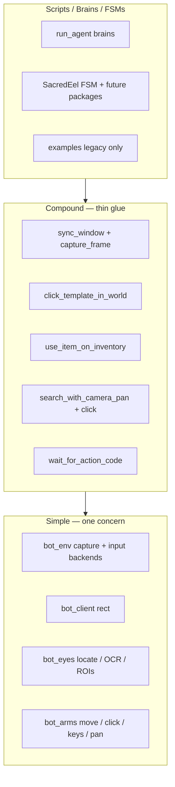

# Function architecture — continuous improvement plan

**Status:** exploration only (no code changes). Companion to [`FUNCTIONS.md`](../FUNCTIONS.md).

**Goals (from product direction):**
- Human-readable, succinct code.
- Reusable building blocks across scripts (mouse A→B, live screen stream, entity/motion tracking, inventory use-on, camera search, etc.).
- No dead or misleading paths relative to those goals.

## Decisions (resolved)

| # | Topic | Decision |
|---|--------|----------|
| 1 | **Canonical entrypoints** | **Exodia core only:** `run_agent.py`, harness, and module FSMs (e.g. `SacredEelFishing/`). Legacy root scripts (`infernal_fishing.py`, `agility.py`, `WhyFletch.py`) are not first-class — deprecate or move to `examples/`. |
| 2 | **Entity / motion tracking** | **Blob-first** (frame diff / background subtraction → connected components). No NPC template tracker in v1. |
| 3 | **Mouse on WSL (`wsl_ps`)** | **Bezier / spline-style paths required** — extend Windows input path so `wsl_ps` is not teleport-only; same human-like motion contract as local PyAutoGUI. |
| 4 | **Masked vs unmasked frames** | **No strong default** — masked world is fine for template match; chat may be minimized but still useful for OCR/events. Keep **both** crops available (masked playspace + chat strip / unmasked chat ROI per chat-panel plan). |
| 5 | **Scheduler** | **`BotLegs` is the single loop owner** — sacred eel and other FSMs should run as tasks/steppers on legs, not bespoke `while` loops (runtime bridge can stay as a polled sidecar). |

### Vocabulary (locked for compounds)

| Term | Meaning |
|------|---------|
| **world** | Main playspace (template/color clicks outside inventory); ROI math may use `playspace_search_roi`. |
| **inventory** | 4×7 grid / `inv=True` template search. |
| **client** | Full RuneLite window rect. |

Compound names: `click_template_in_world`, `click_template_in_inventory`, `use_item_on_inventory(source, dest)`.

---

## Subagent review synthesis (2026-05)

Five parallel reviews (correctness, API design, feasibility, scheduler, vision/stream). **Accepted** items are folded into sections below; this table records disposition.

| Reviewer lens | Accepted into plan | Deferred / rejected |
|---------------|-------------------|---------------------|
| **Correctness** | Fix `use_item_on`; wire `CmdClickImage.inv`; empty-match guards; **reword** capture duplication; add infernal `__main__` inverted action gating; reference brain world-clicking inv template; `use_item_on` empty-index guards; `get_action_text(refresh=True)` after `bot_update` | — |
| **API design** | Keep `click_at`/`move_mouse` names; `Bot` dataclass complements harness (no parallel runtime); search stays in `bot_search`; defer `CmdSearchClick`, `bot_color.py` split, arms renames | Reject wholesale rename to `move_to`/`click`; reject mandatory `search_then_click` wrapper over injectable pan loop |
| **Feasibility** | **MVP = Phase A + minimal wsl_ps path + P0 tests**; pull wsl spline before Phase D; split Phase D; defer sacred→legs until stepper spec exists | Defer full Bezier parity on v1 wsl (ship batched linear path first, like `wsl_windows_middle_drag`) |
| **Scheduler** | **`SacredEelStepper`**, not `HarnessStepper`; legs `_t` small for poll/stop; **throttle + dual-rate stay inside stepper**; pause/stop between-step limitation documented | Reject mapping sacred eel to harness brain / fixed 600 ms as sole scheduler |
| **Vision** | Blob v1 limitations table; `bot_track` uses **unmasked playspace** + exclude inv/chat from diff mask; stream tick metadata; no conflict with `spot_verify` | NPC template tracker v1; full MJPEG redesign in MVP |

---

## 1. Target layering (north star)

**Principle:** Scripts should read like recipes (`wait until idle → search spot → click → wait until fishing`). Compound functions are named sentences. Simple functions never import `bot_actions`.

---

## 2. Code paths that do not fit goals

### 2.1 Broken or misleading behavior

| Issue | Where | Why it matters |
|-------|--------|----------------|
| **`use_item_on` click order** | `bot_actions.use_item_on` | OSRS use-on is **source → target**. Code does `click_here(targets_2, targets_1[0])` then `click_at(targets_1[0])` (destination-first, then source again). Sacred eel correctly uses `click_at(knife)` then `click_at(eel)` in `use_knife_on_eel`. Harness + `ReferenceFishingBrain` use the broken compound. |
| **`use_item_on` empty matches** | `bot_actions.use_item_on` | `targets_1[0]` if `targets_1` empty; no `bot_update` — stale frame if caller skipped refresh. |
| **Infernal `__main__` action gating inverted** | `infernal_fishing.py` | Active loop uses `action_code != 0` to click spot; `0` = fishing (busy) per `bot_action_ui` / `GameState`. Opposite of `keep_fishing` / reference brain. |
| **Reference brain spot click** | `agents/reference_fishing_brain.py` | `CmdClickImage(EEL_TEMPLATE, inv=False)` clicks **inventory fish icon in world** — likely wrong vs legacy `click_on_color` spot strategy. |
| **Redundant capture after refresh** | `infernal_fishing.py`, FSM callers | `get_action_text()` defaults `refresh=True` → second `eyes.update()` immediately after `bot_update`. Sacred FSM uses `get_action_text_robust(refresh=False)` after refresh. |
| **`CmdClickImage.inv` ignored** | `bot_harness.apply_commands` | Field exists on `CmdClickImage` but `click_on_image` always calls `locate_image(..., inv=False)`. Brains cannot request inventory clicks declaratively. |
| **`click_on_image` empty list** | `bot_actions.click_on_image` | `random.choice(target)` raises if no matches; no guard or log. |
| **`hit_escape` marked broken** | `bot_arms.hit_escape` | Comment says "THIS DOES NOT WORK"; still public API. |
| **`wsl_ps` click skips `move_mouse`** | `bot_arms.click_at` | Jumps straight to `wsl_windows_click` — fine for latency, but **A→B path is not shared** with local PyAutoGUI Bezier path (harder to reason about one "move then click" primitive). |

### 2.2 Duplicate logic (same goal, different implementations)

| Activity | Canonical-ish path | Legacy / duplicate | Recommendation |
|----------|-------------------|-------------------|----------------|
| Infernal eel fish + crack | `run_agent.py` + `ReferenceFishingBrain` (after A fixes) | `infernal_fishing.py` `__main__` loop + dead `keep_fishing()` | Fix brain + `use_item_on` in Phase A; deprecate script in Phase C; do not treat legacy loop as canonical until gating fixed. |
| Use knife on eel | `use_knife_on_eel` (sacred) | `use_item_on` (infernal/agent) | One compound: `use_item_on_inv(source_template, dest_template)` with documented click order + tests. |
| Camera search + click | `bot_search.search_with_camera_pan` | `bot_actions.scan_for` | Deprecate `scan_for`; same goal, worse API (hard-coded pan, no relocate, no abort). |
| Agility color gate | `bot_actions.color_is_close` | `agility.check_color` re-wraps + prints `UH OH` | Delete local wrapper; use shared compound or predicate. |
| Tick sleep | `constants.OSRS_TICK_S`, `CmdWaitTicks`, `BasicUtils.wait_ticks` | Sacred FSM inline sleeps, infernal `random.randint` waits | Single `sleep_ticks(n, jitter=...)` in `bot_wait` or `constants` helper. |

### 2.3 Scripts that bypass building blocks

| Script | Problem |
|--------|---------|
| **`WhyFletch.py`** | Hard-coded monitor coords `[1805, 754]` — no `bot_init`, no client rect, not portable. Not a reusable pattern; either migrate to template + `click_at` in client space or mark `examples/` deprecated. |
| **`agility.py`** | Course logic as copy-pasted `if check_color` blocks + `mouse_fidgit`; no `BotLegs` task, no FSM. Readable only at micro scale; not composable. |
| **`infernal_fishing.py`** | `BotLegs` wiring commented out; active loop reimplements brain inline; `click_on_color` for spots while agent uses `click_on_image` — inconsistent spot strategy. |

### 2.4 Dead or dormant APIs

| API | State |
|-----|--------|
| `scan_for` | Only commented references |
| `click_color_near_color` | No callers |
| `bot_actions.check_color` | Duplicated by agility |
| `keep_fishing` | Never called from `__main__` |
| `BotArms.drop_all` | No compound wrapper; `wsl_ps` path untested for shift-drop |
| `find_image_in_scene` (ORB) | Parallel to `locate_image`; no production caller |
| `resolve_inventory_slot_items` | Explicitly unimplemented stub in `bot_eyes` |
| Significance gate | Disabled in `run_agent.py` (`enable_significance_gate=False`) — fine, but brains should not rely on skip behavior without documenting why |

### 2.5 Confusing defaults / footguns

| Item | Detail |
|------|--------|
| **`BotLegs._t` default `6000` ms** | Doc says use `600` for OSRS tick; `run_agent` overrides, but any new script forgetting this runs 10× slower. Default should match `constants.OSRS_TICK_S`. |
| **`BotLegs.to_do` never clears** | Tasks repeat every cycle — correct for harness stepper, surprising for one-shot tasks. Document or add `add_task(..., once=True)`. |
| **Capture cost per refresh** | `bot_update` → `client.update()` (rect only) + `setRect()` → `update()` → **one** `check_client()` grab. **Not** two grabs inside a single `bot_update`. Real duplication: harness `step()` calls `refresh_geometry()` twice per agent tick; callers that `bot_update` then `get_action_text(refresh=True)`. |
| **`BotLegs` mods without `setRect`** | `run_agent.py` uses `mods=[client, eyes]` | `eyes.update()` alone can desync if window moved — prefer `bot_update` or `setRect` on geometry change. |
| **`color_is_close` parameter `range` shadows builtin** | Used as cluster distance; hurts readability. |
| **Action code semantics** | `0` = fishing (busy), `1` = idle, `2` = no UI — easy to invert when reading `action != 0` in old infernal code. Centralize naming in script logic via `bot_action_ui` only. |
| **Masked `curr_client` vs `curr_client_unmasked`** | Template match on masked world hides UI but also removes context; monster/entity tracking needs **unmasked playspace** ROI helper (see §4). |

---

## 3. Building blocks to strengthen (reuse across scripts)

### 3.1 Input / mouse (`bot_arms` + `bot_env`)

| Block | Today | Proposed shape (names illustrative) |
|-------|--------|-------------------------------------|
| Move A→B | `move_mouse` (Bezier) vs `wsl_windows_click` teleport | Keep **`move_mouse` / `click_at` names**; implement **`wsl_windows_move_path`** (batched PS steps, v1 linear+jitter like `wsl_windows_middle_drag`; v2 spline samples from same math as local path). Need **`wsl_windows_get_cursor`** or tracked last position — `pyautogui.position()` is wrong on `wsl_ps`. |
| Click | `click_at` | Same entry point; `wsl_ps` branch calls move path then click, not teleport-only. |
| Modifier chords | `drop_all` only | `with_modifier("shift", fn)` or `click_all(points, modifier="shift")` — fixes compound-action gap from `bot_arms_test.py`. |
| Camera | `pan_*`, `control_camera`, env arrows | `rotate_camera(direction, *, mode=keys\|drag)` — hide `win_rect` math from scripts. |
| Walk | `walk_direction` + `ground_click_target` | Keep split: math in `bot_search`, execution in arms. |

### 3.2 Vision (`bot_eyes`)

| Block | Today | Gap |
|-------|--------|-----|
| Frame refresh | `update` / `setRect` | `sync_window(client, eyes)` (rect only) + `eyes.capture_frame()` (one grab). Add `crop_playspace(*, unmasked=True)` for blobs; masked `curr_client` for templates. |
| Template hits | `locate_image` / `locate_image_detailed` | Standardize return type: always `LocateImageResult` at compound boundary; list of points is legacy. |
| Color | `locate_color`, `locate_cluster` | Document BGR vs RGB once in `bgr_bounds_from_color` module doc. |
| Action strip | `get_action_text`, `wait_for_action_code` | Good; ensure all scripts use predicates not raw `== 0`. |
| Inventory | `find_inventory`, occupancy grid, `count_*` | Good; wire cracking scripts to `count_inventory_objects` not raw `len(locate_image)`. |
| Chat | bottom 30px heuristic `chat_rect` | Planned: filter-bar anchor ([`runelite-chat-panel-localization.md`](runelite-chat-panel-localization.md)). |

### 3.3 Streaming & recording (monster / motion tracking)

| Block | Today | Gap for “monsters walking around” |
|-------|--------|-------------------------------------|
| Live MJPEG | `bot_stream.FramePublisher` | Publishes masked world + strips; add **playspace** + **chat_strip** (OCR/info) + optional **blob overlay** stream; attach tick/rect metadata in index or headers. |
| Session PNGs | `bot_frames`, `bot_session` | Offline replay; not a tracking pipeline. |
| Motion / entities | — | **Missing layer.** Proposed `bot_motion` or `bot_track` (future): |

Proposed **`bot_track`** (blob-only v1) — **unmasked playspace**, exclude `inventory_rect` + `chat_rect` from diff mask (same spirit as `bot_spot_verify` unmasked preference):

| API | Role |
|-----|------|
| `playspace_bgr(eyes)` | Crop via `playspace_search_roi`; prefer `curr_client_unmasked` |
| `motion_mask(prev, curr, static_exclude)` | Diff/MOG2 |
| `detect_blobs(mask)` | Contours → bbox + centroid (client-local) |
| `update_tracks(eyes, state)` | Greedy ID assignment; compound `track_blobs()` |
| `overlay_tracks(bgr, tracks)` | Debug / stream `playspace_blobs` |

**Blob v1 is sufficient for:** motion detect, coarse “world changed”, debug overlay, combat verify signal later.

**Not sufficient for:** NPC identity, stationary targets, click-accurate feet (centroid ≠ tile), clean IDs during camera pan (gate on pan-in-progress).

**Stream gaps:** add `playspace` + `playspace_blobs` keys; publish `{tick, ts, client_rect}` beside JPEG (index or `/snapshot/*.json`); one `publish_from_eyes` per `eyes.update()` aligned with harness tick.

**No conflict with `locate_image` / `spot_verify`:** templates on masked world; spots on unmasked; blobs on unmasked playspace with UI masked out of diff only. Safe order per tick: `update()` → `track_blobs` → `locate_*`.

### 3.4 Search & click (already strong)

Keep `search_with_camera_pan` + injectable `locate` / `pan` / `relocate` as the **one** search compound. Replace `scan_for` documentation references with this pattern.

Sacred eel FSM `_seek_spot_click` is the **reference recipe** — keep injectable `search_with_camera_pan` wiring in FSM (~40 lines); do **not** hide behind a mandatory `search_then_click` wrapper unless a second script copies the same lambdas.

### 3.5 Wait / time

| Block | Today | Unify |
|-------|--------|-------|
| Condition poll | `poll_until` | Keep as generic simple |
| Action strip wait | `wait_for_action_code` | Compound on top of poll |
| Tick wait | scattered | `wait_ticks` in one module used by harness `CmdWaitTicks`, FSM, scripts |

### 3.6 Init / refresh

| Block | Today | Proposed |
|-------|--------|----------|
| Startup | `bot_init` | Return frozen `Bot(client, eyes, arms)` dataclass; optional list unpack shim for migration. Complements `ExodiaHarness` — do not introduce a fourth runtime pattern. |
| Refresh | `bot_update` | Split: `sync_window(client, eyes)` vs `eyes.capture_frame()`; document harness double-refresh cost in `step()`. |

---

## 4. `bot_actions.py` — reshape (conceptual)

Current file mixes init, color math, and compounds. For readability:

| Keep in `bot_actions` | Move out |
|----------------------|----------|
| `bot_init`, `bot_update` (or rename) | `bgr_bounds_from_color` → `bot_color.py` or `bot_eyes` helpers |
| Thin compounds: `click_template_in_world`, `click_template_in_inventory`, `use_item_on_inventory`, `click_color_in_world` | `scan_for` → delete after migration |
| | `mouse_fidgit` → `examples/` only |

**Harness commands** should mirror compound names (`CmdClickImage` → same `inv` semantics as `click_template_in_*`).

---

## 5. Agent / harness alignment

| Topic | Plan |
|-------|------|
| BrainCommand coverage | Add `CmdWaitForAction`, `CmdSearchClick` only if they reduce imperative code in FSM; otherwise FSM stays script-level and brain stays declarative. |
| Imperative vs declarative | `ReferenceFishingBrain` calls `harness.eyes.locate_image` inside `decide` — breaks “all side effects via commands”. Move counting to `Observation` / `GameState` (eel count field) or `Cmd` that only reads. |
| Verify | `verify_action` only sees inventory/action line — sufficient for skilling; combat may need `playspace_changed` signal later. |
| Double refresh in `step()` | refresh → observe → decide → apply → **refresh again** — intentional for verify; document cost; optional `refresh=False` on apply for tick budget. |

---

## 6. Sacred eel vs infernal — convergence

Sacred eel is the **more mature** path: FSM, events, spot verify, `search_with_camera_pan`, runtime bridge.

| Infernal gap | Sacred eel has |
|--------------|----------------|
| Spot verify | `bot_spot_verify` |
| Structured waits | `wait_for_action_code` |
| Walk relocate | FSM `_relocate` |
| Scaling phases | `ScalePhase` sub-state |

**Convergence plan:** Port infernal agent brain to sacred-style spot config (or shared `bot_spot_verify` generalization), delete color-click spot path in infernal legacy, single `use_item_on_inv` compound.

---

## 7. Readability / succinctness tactics (no behavior change)

1. **Module one-liners at top** — “Arms: screen input only. Coordinates: screen space unless `*_client_local`.”
2. **Type aliases** — `Point = tuple[int, int]`, `Rect = tuple[int, int, int, int]` shared from `bot_types.py`.
3. **Remove debug prints from hot paths** — `pan_*`, `clamp`, `color_is_close` print statements → `logging` debug or `_DEBUG` only.
4. **Fix misleading comments** — `click_here` doc still mentions `win_rect` param that does not exist.
5. **`agility.py` structure** — table-driven course: `STEPS = [{"color": ..., "range": 50}, ...]` loop instead of 7 nearly identical blocks.
6. **FUNCTIONS.md** — link to this plan; add “canonical path” column per compound.

---

## 8. Testing strategy (when implementing)

| Priority | Test |
|----------|------|
| P0 | `use_item_on` / `use_item_on_inventory` click order (mock arms, call sequence) |
| P0 | `click_on_image` / `click_template_in_world` empty matches |
| P0 | `wsl_windows_move_path` shape test (mock `_wsl_run_ps`) |
| P1 | `CmdClickImage` with `inv=True` passes through |
| P1 | `ReferenceFishingBrain` / infernal gating regression test (action_busy semantics) |
| P1 | `search_with_camera_pan` relocate path (existing tests extended) |
| P2 | Synthetic `motion_mask` + `detect_blobs` |
| P2 | `SacredEelStepper` throttle: SCALING burst vs FISHING interval (mock clock) |
| P2 | Golden-image tests for `locate_sacred_eel_spots` (have some) |

---

## 9. Suggested implementation phases

### MVP (ship first)

**Phase A** + **minimal wsl_ps mouse** + **P0 tests**. Do **not** migrate sacred eel to legs yet.

1. Fix `use_item_on` → `use_item_on_inventory` (source then dest; empty guards; optional refresh).
2. Wire `CmdClickImage.inv`; guard empty template clicks.
3. Fix `ReferenceFishingBrain` spot strategy + document infernal `__main__` as broken/deprecated.
4. Default `BotLegs._t` to `int(constants.OSRS_TICK_S * 1000)`.
5. `wsl_windows_move_path` (batched linear steps) + cursor start tracking; wire `click_at` `wsl_ps` branch.
6. Unit tests: use-on order, empty click, mock wsl path.

### Phase A — Correctness (MVP core)

Same as MVP items 1–4; add `get_action_text*(refresh=False)` after `bot_update` everywhere in Exodia core.

### Phase A2 — Input (MVP core)

Item 5–6 above. v2: reuse Bezier control points in PS script (not required for MVP).

### Phase B — Consolidate compounds

- Rename/wrap compounds to vocabulary table; delete `scan_for`.
- `use_item_on_inventory` replaces `use_knife_on_eel` + harness path.
- `sync_window` + `capture_frame`; document harness refresh policy.
- **C-lite:** README/FUNCTIONS “canonical path” — legacy scripts frozen, no folder moves yet.

### Phase C — Script hygiene

Move `WhyFletch`, `infernal_fishing`, `agility` → `examples/` after B. New work: `run_agent` brains + package FSMs only.

### Phase D-perception (defer post-MVP)

- Chat panel plan — `chat_messages_rect` for OCR + blob exclusion.
- `crop_playspace`, `crop_chat`; stream keys `playspace`, `playspace_blobs` + tick metadata.
- `bot_track` module per §3.3 API table.

### Phase E — Scheduler unification (spec before code)

**Not** `HarnessStepper`. Add **`SacredEelStepper.tick()`** as sole `BotLegs` task:

| Concern | Behavior |
|---------|----------|
| `legs._t` | Small (100–250 ms) for responsive `runtime.poll` / stop / pause between steps |
| Throttle | `--interval` + `should_throttle()` **inside** stepper (FISHING/SEEK 6 s; SCALING back-to-back) |
| `runtime.poll` | Start of each `tick()`; status publish each tick |
| Pause | Between steps only (same as today) — document limitation |
| Stop | F8 `_stop` → set `legs.flag` or early return in stepper |
| `force_step` | Bypass throttle one iteration |
| Blocking `machine.step()` | Accept ctl stall during long waits OR future second task (threading out of scope) |
| `update_all` | `mods=[client, bot_e]`; use `ctx.refresh` / `bot_update` inside FSM — avoid double capture |

### Phase F — Agent ergonomics (defer)

- `GameState.inventory_counts`; brains read observation only (no `locate_image` in `decide`).
- Optional `playspace_changed` verify signal once `bot_track` exists.
- Defer `CmdSearchClick` / `CmdWaitForAction` until a brain needs them.

---

## 10. Open questions

All resolved — see **Decisions (resolved)** at top.

---

## 11. Review iteration log

| Round | Action |
|-------|--------|
| Initial | Plan + FUNCTIONS.md from codebase survey |
| User decisions | Canonical Exodia-only; blobs; Bezier/spline wsl; dual crops; BotLegs scheduler |
| **5 subagents** | Correctness, API, feasibility, scheduler, vision — synthesis in §“Subagent review synthesis” + phase/MVP rewrite |

## 12. Checklist — plan exhaustion

Explored: layering, broken paths, duplicates, dead APIs, defaults, mouse/stream/tracking gaps, harness/agent mismatch, sacred/infernal convergence, readability, tests, phases, product decisions, **subagent review (2026-05)**.

**Not explored deeply:** `window_tool.py` internals, every env var combination, full `bot_inventory_detect` scoring, Corpus docs under `../Corpus/`, threaded runtime poll during blocking FSM steps.

**Next review triggers:** After Phase A merge; before Phase E (publish `SacredEelStepper` spec snippet in this file); when chat-panel plan lands.

---

*Update this file as decisions are made. Implementation belongs in separate PRs; keep [`FUNCTIONS.md`](../FUNCTIONS.md) in sync when APIs change.*
