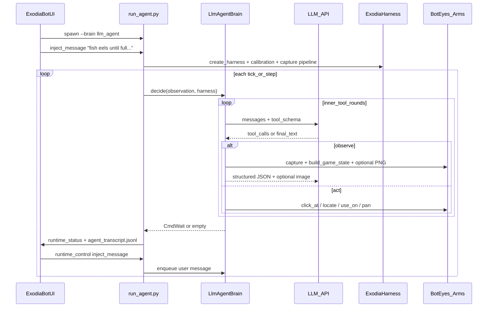

# LLM agent console plan

**Status:** planning — **MVP:** start `llm_agent` with no spec file; operator defines the task via ExodiaBotUI **Agent console** (`inject_message`). Spec files, game-state cache UI, and tick tracker are follow-on milestones.

**Companion:** [`FUNCTIONS.md`](../FUNCTIONS.md) (call recipes), [`function-architecture-plan.md`](function-architecture-plan.md) (layering).

---

## Milestone 0 — Immediate deliverable (console task injection, no spec)

**Goal:** Start the bot, type what you want in the UI, and see if it can observe + click — **no markdown spec file required**.

| Step | What you do | What ships |
|------|-------------|------------|
| 1 | Preferences: Exodia root, Python, **LLM API key + model** | Settings → spawn env |
| 2 | **Start agent** (no specs loaded) | `run_agent.py --brain llm_agent` — specs optional |
| 3 | Type task in **Agent console** → Send | `inject_message` → brain queue → LLM turn |
| 4 | Watch log + minimal status; Stop when done | Existing log panel + `agent_phase` chip |

**Bootstrap conversation (no spec):**

- System prompt only ([`agents/prompts/system_base.md`](../agents/prompts/system_base.md)): role, tools, “wait for operator task if none loaded.”
- **First `inject_message` text = the entire task** (e.g. “Fish infernal eels until inventory is full, then crack with Imcando hammer”).
- Further console messages **override or refine** the current task (operator precedence over any later-loaded spec).
- Brain may return `CmdWaitTicks(1)` when idle and queue empty so the process stays alive waiting for injection.

**Explicitly deferred past MVP:** spec browser requirement, `example_task.md`, full game-state cache panel, session tick tracker UI, transcript JSONL tail, multimodal screenshots, most polish in Phase 4–5.

**Manual smoke (you judge success):**

```bash
cd Exodia
export EXODIA_LLM_API_KEY=...
python run_agent.py --brain llm_agent --stream-port 0
# another terminal or UI:
python exodia_ctl.py inject_message --args '{"text":"Click the fishing spot and start fishing."}'
```

---

## Current state vs target

**What exists today**

| Layer | Status |
|-------|--------|
| Screenshot + vision | Solid: [`bot_eyes.py`](../bot_eyes.py), [`bot_env.py`](../bot_env.py), inventory/world pipelines |
| Mouse/keyboard | Solid: [`bot_arms.py`](../bot_arms.py) |
| Harness tick loop | [`bot_harness.py`](../bot_harness.py) `observe → brain.decide → apply_commands` |
| Spec plumbing (UI → CLI) | [`ExodiaBotUI`](../ExodiaBotUI) loads `.md` specs; [`run_agent.py`](../run_agent.py) validates `--spec` paths and logs previews |
| Spec → brain | **Not wired** — documented gap in [`FUNCTIONS.md` §9](../FUNCTIONS.md) |
| Agent policy | [`agents/reference_fishing_brain.py`](../agents/reference_fishing_brain.py) — rule-based, not spec-driven LLM |

**Target behavior**

- **Primary path (MVP):** User starts an **LLM agent** with **no spec**, types the task in the **Agent console**, and the bot attempts it.
- **Secondary path (later):** Optional markdown **task spec** at start (`--spec`) plus console messages to steer mid-run.
- Python runs a **prompt-loop inside each agent step**: LLM may call tools to **observe** (structured + optional screenshot), **act** (click/move), then continue until terminal outcome or safety limits.
- Loop runs until **user Stop**, **pause**, or LLM signals **task complete / failed**.
- Electron shows **live transcript + phase** from `runtime_status.json` and action logs; it does **not** call the LLM API directly.
- **Agent console** delivers mid-run instructions via **`runtime_control.json`** (`inject_message`).
- **Later:** Electron caches **current + previous** game state and tracks **estimated OSRS ticks** on wall clock (LLM steps do not align 1:1 with harness ticks).



---

## Architecture decisions (locked)

1. **LLM host: Python** — `LlmAgentBrain` implements [`BotBrain`](../bot_harness.py); Electron passes env and displays status only.
2. **Vision to LLM: both** — default **structured** `observe`; optional **`observe_screenshot`** (multimodal) when needed.
3. **Tick timing: Electron is authoritative for elapsed ticks (later)** — wall-clock × 600 ms; harness `context.tick` is informational only during long LLM calls.

---

## Phase 1 — Agent tools and context (Python)

### 1.1 Tool executor — [`agent_tools.py`](../agent_tools.py) (new)

| Tool | Behavior | Reuses |
|------|----------|--------|
| `observe` | Refresh frame; return game state, action code, inventory labels, client rect | [`build_game_state`](../bot_gamestate.py), [`read_inventory_labels`](../bot_inventory_items.py) |
| `observe_screenshot` | observe + PNG/base64 (later) | `eyes.capture_frame` |
| `click_at` | Screen coords + jitter | `arms.click_at` |
| `click_image` | Template + `inv` flag | `click_on_image` |
| `click_color` | BGR cluster (later) | `click_on_color` |
| `use_item_on` | Named items (later) | `use_named_item_on_named_item` |
| `read_inventory` | Force label pass (later) | `read_inventory_labels` |
| `wait_ticks` | Sleep N OSRS ticks | `CmdWaitTicks` |
| `pan_camera` | Pan directions (later) | `arms.pan_*` |
| `task_complete` / `task_failed` | Terminal brain state (later) | — |

Return shape: `{ "ok": bool, "data": {...}, "error": "..." }`.

**MVP tools:** `observe`, `click_at`, `click_image`, `wait_ticks`.

### 1.2 System context — [`agents/prompts/`](../agents/prompts/) (new)

- `system_base.md` — role, safety, capabilities, wait for operator if no spec.
- `tools.md` — human-readable tool docs (sync with JSON schema).

[`agents/context_builder.py`](../agents/context_builder.py) (new):

- `build_agent_context(spec_paths)` — **`spec_paths` may be empty (MVP)**; task via `inject_message`.
- [`run_agent.py`](../run_agent.py): specs **optional** for `llm_agent`.

### 1.3 LLM client — [`agents/llm_client.py`](../agents/llm_client.py) (new)

OpenAI-compatible chat + tools. Env: `EXODIA_LLM_API_KEY`, `EXODIA_LLM_MODEL`, `EXODIA_LLM_MAX_TOOL_ROUNDS`, etc.

---

## Phase 2 — `LlmAgentBrain` and harness

### 2.1 [`agents/llm_agent_brain.py`](../agents/llm_agent_brain.py) (new)

Inner loop: LLM → `agent_tools` → append results until final message or cap.

- `enable_significance_gate=False` for `llm_agent`.
- Publish status during long LLM calls (not only when harness tick advances).

### 2.2 Transcript + status (later)

- `agent_transcript.jsonl`, `context.game_state`, `agent_phase`, `agent_last_message`.

### 2.3 `inject_message` (MVP)

```json
{ "command": "inject_message", "args": { "text": "Bank when inventory is full." } }
```

- Brain queue → `Operator: <text>` user messages on next `decide()`.
- `context.pending_user_messages` in status.
- CLI: `exodia_ctl.py inject_message --args '{"text":"..."}'`.

### 2.4 Register brain in [`run_agent.py`](../run_agent.py)

`--brain llm_agent` → `LlmAgentBrain(context=build_agent_context(spec_paths))`.

---

## Phase 3 — ExodiaBotUI

### 3.1 MVP start (no spec)

- [`bots.manifest.json`](../ExodiaBotUI/bots.manifest.json): `agent_llm`, `runtimeCommands` includes `inject_message`.
- [`BotsTab.tsx`](../ExodiaBotUI/src/panels/BotsTab.tsx): **Start agent** without loaded specs.
- `AGENT_BOT_ID` → `agent_llm`.

### 3.2 Settings → env

`llmApiKey`, `llmModel` → `EXODIA_LLM_*` on spawn (never log key).

### 3.3 MVP status

[`BotTasksPanel.tsx`](../ExodiaBotUI/src/panels/BotTasksPanel.tsx): `agent_phase`, `agent_last_message`, inject ack.

### 3.4 Game state cache (later)

Electron `GameStateCache`: current + previous from `context.game_state`.

### 3.4b Session tick tracker (later)

Wall-clock estimated ticks (~600 ms); `ticksSinceLastAgentTurn`, etc.

### 3.5 Agent console (MVP)

- `AgentConsole.tsx` — input, history, Send.
- `window.exodia.sendAgentMessage(text)` → `inject_message`.

---

## Phase 4 — Spec format (post-MVP)

Optional [`specs/example_task.md`](../specs/example_task.md); Specs tab as task library, not required to run.

---

## Phase 5 — Hardening

Token caps, multimodal gating, `task_complete` + spec success criteria.

---

## Out of scope for MVP

- Required spec file; Electron-hosted LLM; full cache/tick UI; transcript viewer; automated tests; replacing `reference_fishing_brain`.

---

## Implementation checklist

### Milestone 0 (ship first)

- [ ] **mvp-agent-tools** — `agent_tools.py`: observe, click_at, click_image, wait_ticks
- [ ] **mvp-llm-brain** — `llm_client`, `llm_agent_brain`, `system_base.md`, inject queue, `--brain llm_agent`
- [ ] **mvp-inject-runtime** — `inject_message` on `RuntimeBridge`, run_agent wiring, significance gate off
- [ ] **mvp-agent-console** — Start without specs, Agent console, LLM settings → env

### Milestone 1+

- [ ] **agent-tools-full** — remaining tools
- [ ] **transcript-runtime** — `agent_transcript.jsonl`, rich `game_state` in status
- [ ] **game-state-cache** — `GameStateCache` + `SessionTickTracker` + UI
- [ ] **spec-files** — optional `--spec`, example_task.md
- [ ] **docs** — FUNCTIONS.md / README / ExodiaBotUI README

---

## Suggested implementation order

1. `agent_tools.py` (minimal).
2. `llm_client` + `llm_agent_brain` + prompts.
3. `run_agent.py` + `inject_message`.
4. ExodiaBotUI console + start without specs.
5. Cache, ticks, specs, docs (Milestone 1+).
