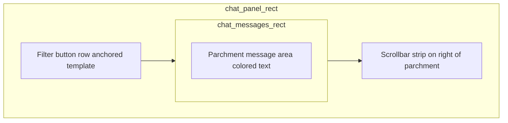

# Chat panel detection (filter-bar anchor + message ROI)

## Product goal

Know **where chat lives** so automation can reliably **spot game/system messages** (colored pixel text, OCR, or template snippets). That requires more than bottom-30px heuristics: a stable **panel bounding region** plus a tighter **messages-only ROI** inside the parchment area.

## Layout model (three parts)

Rough structure from reference UI:

- **Anchor**: filter button row (distinct, user-provided crop) → `chat_filter_bar_rect` **XYWH** client-local.
- **Extend upward**: `extend_up = EXODIA_CHAT_TEXT_PAD_TOP` (default tuned ~160+, overridable) → **`chat_panel_rect`** (or **`chat_rect`**) spanning **messages + optional input line + filter bar**.
- **Messages sub-ROI** (`chat_messages_rect_client_local`): **inside panel**, **excluding** bottom filter-row height **and** a **narrow right strip** (`EXODIA_CHAT_SCROLLBAR_STRIP_W`, default ~12–18px) to keep OCR/templates off scrollbar chrome. Apply small **symmetric horizontal / top insets** via env constants if parchment has a stone border.

**Width**: Template match gives bar width `tw`; bar may sit inside a wider panel. **v1**: set panel **x** = `max(0, bx - pad_left)`, **w** = `min(client_w - x, tw + pad_h)` with env pads; **v2**: optional second cue (scrollbar vertical edge / full-chat template from [`image-82e276d7...`](/home/hata/.cursor/projects/home-hata-Botting/assets/c__Users_hataj_AppData_Roaming_Cursor_User_workspaceStorage_0e4fdfc9a2a6a40b57dd07f237a4e59e_images_image-82e276d7-38fd-478a-b1ec-badd0ab53e04.png)) if single-anchor width is flaky on some layouts.

## Current code state

- [`../bot_eyes.py`](../bot_eyes.py) **`find_chat`**: unused legacy path (`chat_template.png`, 70% scale, awkward return type); **`chat_rect`** in **`setRect`** is fixed **`[0, client_h−30, 520, 30]`** — inadequate for parchment + messages.
- **`ocr_dialogue_roi`**: crops **`chat_rect`**; after this work, **`chat_rect`** should track **panel** (or **`ocr`** should prefer **`chat_messages_rect`** when present — preference: **prefer `chat_messages_rect` for OCR/text detection**, keep **`chat_rect`** as outer panel for mask consistency).

## Assets

1. **Primary template**: **`images/chat_filter_bar_template.png`** from the tight filter-bar crop ([`image-9a195847...`](/home/hata/.cursor/projects/home-hata-Botting/assets/c__Users_hataj_AppData_Roaming_Cursor_User_workspaceStorage_0e4fdfc9a2a6a40b57dd07f237a4e59e_images_image-9a195847-75f2-4b5e-b723-bf70b7a35f40.png)).
2. **Reference (optional)**: full chat screenshot [`image-82e276d7...`](/home/hata/.cursor/projects/home-hata-Botting/assets/c__Users_hataj_AppData_Roaming_Cursor_User_workspaceStorage_0e4fdfc9a2a6a40b57dd07f237a4e59e_images_image-82e276d7-38fd-478a-b1ec-badd0ab53e04.png) — document layout; optionally **`EXODIA_CHAT_PANEL_TEMPLATE`** later.
3. **`.gitignore`**: negate committed templates (**`!images/chat_filter_bar_template.png`**) where needed.

## Detection algorithm

1. Grayscale **`matchTemplate`** on **`curr_client`** (native scale first; optional small multi-scale `[1.0, 0.9, 1.1]` if score low).
2. Best peak → **`chat_filter_bar_rect`** = **`[bx, by, tw, th]`**.
3. **`chat_panel_rect`**: **`y_panel = max(0, by - extend_up)`**, **`h_panel = min(client_h - y_panel, extend_up + th)`**, **`x/w`** from **`bx/tw`** + **`EXODIA_CHAT_PANEL_PAD_*`** (document defaults).
4. **`chat_messages_rect`**: **`y_top`** = **`y_panel` + inset_top**, **`height`** ≈ **`extend_up`** minus **input-line reserve** (**`EXODIA_CHAT_INPUT_LINE_H`**, heuristic ~28–36px)** minus scrollbar logic; **`width`** ≈ **`w_panel - horizontal_insets - scrollbar_strip_w`**; clamp with **`_clamp_roi`**.
5. **`perception_envelope`**: **`chat_filter_bar_rect_client_local`**, **`chat_panel_rect_client_local`** or reuse **`chat_rect`** for outer panel, **`chat_messages_rect_client_local`**, **`ui_blackout_panels`** unchanged.

## API / wiring

- Refactor **`find_chat`** → instance API using **`curr_client`**; set **`self.chat_rect`** = **panel XYWH**, **`self.chat_messages_rect`**, **`self.chat_filter_bar_rect`** on success; **fallback heuristic** when template missing/low score.
- **`update` / `setRect`**: after **`check_client`**, **`find_inventory`**, invoke **`find_chat`** when template loads.
- **`ocr_dialogue_roi`**: crop **`chat_messages_rect`** first if set, else **`chat_rect`** — reduces leakage from buttons when scanning messages.

## Debug overlays

- **`draw_chat_detection_debug`**: **red** = filter bar, **green** = panel (**`chat_rect`**), **blue** = **messages ROI**, optional **cyan** 8-split on bar strip.
- **`capture_runelite_once.py`**: **`--annotate-chat`** (or bundle into **`--annotate`**) saves **`*_chat_detection_debug.png`**.

## Tests / verification

- Manual: overlay aligns parchment + scrollbar + buttons on resizeable-modern layout.
- Optional unit test: synthetic canvas with pasted template asserting rect math (`tests/bot_eyes_perception_test.py`).

## Risks / follow-ups

- Rescale / repositioned UI: env-tuned pads and multi-scale; possible v2 panel template.
- **Selected tab (“All” indented)**: phase-2 heuristic (per-cell luminance along bar) optional for agent state.
- Message parsing (color blobs vs OCR) stays separate; this plan only establishes **regions**.
