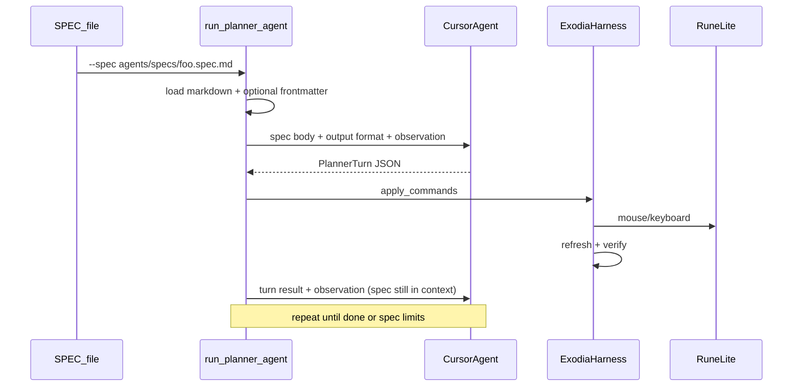

# SPEC-driven Cursor planner agent

**Status:** planning — not implemented.

**Companion:** [`function-architecture-plan.md`](function-architecture-plan.md) (harness / BrainCommand layering), [`llm-agent-console-plan.md`](llm-agent-console-plan.md) (UI console injection path — different entry, can converge later).

**Origin:** Agentic bot prototype discussion — script points at a Markdown SPEC, feeds it to a Cursor agent, loops observe → plan → act → verify.

---

## Goal

Add a Cursor SDK–backed planner loop on top of `ExodiaHarness`: `run_planner_agent.py --spec agents/specs/foo.spec.md` loads the spec, feeds it to the Cursor agent as the run brief, then loops until the spec's goal is met or limits are hit.

## Implementation checklist

- [ ] `agents/spec_loader.py` + `agents/specs/infernal_eel.spec.md` — parse optional YAML frontmatter, validate templates, feed markdown body to agent
- [ ] `agents/planner_protocol.py` — PlannerTurn schema, observation summarizer, JSON parse → BrainCommand
- [ ] `agents/cursor_planner.py` — Cursor SDK `Agent.create` session, start/next_turn, error handling
- [ ] `agents/planner_loop.py` — load spec → feed to agent → observe → plan → apply → verify; caps, runtime bridge, `planner_turns.jsonl`
- [ ] `run_planner_agent.py` — CLI (`--spec` required); reuse `run_agent.py` harness/calibration/stream/runtime setup
- [ ] `cursor-sdk` in requirements + README quickstart (`CURSOR_API_KEY`, `--spec` path)

---

## Core idea

You write a **Markdown SPEC file** describing what the bot should do and how it may act. The script's only job is to:

1. Load the SPEC
2. Feed it to the Cursor agent (plus live game observations each turn)
3. Execute whatever structured commands the agent returns

No per-run goal strings on the CLI — **`--spec` is the entry point**.



- **SPEC owns**: goal, action vocabulary, templates, constraints, optional limits — all as markdown you can read and edit.
- **Script owns**: loading spec, optional validation, observation formatting, execution, safety caps, logging.
- **Cursor agent owns**: choosing the next step each turn (LLM-plans-steps).

Turn-based, not tick-based — one Cursor call per macro-decision after the previous commands finish.

---

## SPEC file format (Markdown)

New directory: `agents/specs/` with example `agents/specs/infernal_eel.spec.md`.

**Format: Markdown** (`.spec.md` or `.md`). The script **feeds the spec content to the agent with minimal rewriting** — you write the brief; the loader adds a thin wrapper (output JSON schema + default action manual) around it.

### Optional YAML frontmatter

Optional `---` block at the top for machine-readable metadata only:

```yaml
---
name: infernal_eel          # required for logs if present; else derived from filename
max_turns: 100              # optional run cap
max_ms: 0                   # optional wall-clock cap (0 = unlimited)
templates:                  # optional — loader validates these PNGs exist
  - infernal_eel_fish.png
  - imcando_hammer.png
---
```

If frontmatter is omitted, the entire file is treated as the agent brief and limits fall back to CLI defaults.

### Markdown body (the agent brief)

Conventional sections (not rigidly enforced):

| Section | Purpose |
|---------|---------|
| `# Goal` | What to accomplish in-game |
| `# Instructions` | How to interpret state, when to wait, priorities |
| `# Templates` | PNG filenames and what each is for |
| `# Constraints` | Hard rules |
| `# Success` | When to set `done: true` vs keep looping |
| `# Actions` | Optional override of default BrainCommand docs |

### Example spec

```markdown
---
name: infernal_eel
max_turns: 100
templates:
  - infernal_eel_fish.png
  - imcando_hammer.png
---

# Goal

Fish infernal eels at the spot until inventory has 22 eels, then crack them
with the Imcando hammer. Repeat indefinitely until stopped externally.

# Instructions

- `action_busy` (green action line) means a skill is in progress — wait; do not click the spot.
- When inventory reaches 22 eels, switch to cracking: use hammer on eels.
- After cracking, inventory count drops; resume fishing when idle.

# Templates

| Name | File | Use |
|------|------|-----|
| Fishing spot | `infernal_eel_fish.png` | Click in playspace to fish |
| Eel icon | `infernal_eel_fish.png` | Inventory target for cracking |
| Hammer | `imcando_hammer.png` | Use on eels |

# Constraints

- Never click the fishing spot when `action_busy` is true.
- Prefer `CmdWaitTicks(1)` or `CmdWait` when waiting for fishing to start.
- Only use templates listed above.

# Success

One full cycle: fish to 22 → crack until no eels remain → fish again.
Set `done: true` only on unrecoverable error; otherwise keep looping.
```

### How the script feeds the spec to the agent

Module `agents/spec_loader.py`:

- **`load_spec(path) -> PlannerSpec`** — read UTF-8, split YAML frontmatter, validate template PNGs, derive `name`
- **`render_agent_brief(spec) -> str`** — wrapper + default action manual + markdown body verbatim
- **`spec_to_run_meta(spec) -> dict`** — path, sha256, name, limits for `run_meta.json`

First agent message = brief + PlannerTurn JSON schema + initial observation.

Follow-ups = turn result + verify + observation (multi-turn session retains spec from turn 1).

Snapshot spec to `logs/<run_id>/spec.md` for reproducibility.

---

## Planner protocol (structured agent output)

Module `agents/planner_protocol.py`:

- **`DEFAULT_ACTION_MANUAL`**: docs for `BrainCommand` types from `bot_harness.py`
- **`PlannerTurn` JSON** the agent returns each turn:

```json
{
  "reasoning": "short explanation",
  "done": false,
  "commands": [
    {"type": "CmdClickImage", "template": "infernal_eel_fish.png", "inv": false}
  ]
}
```

- **`parse_planner_response(text) -> PlannerTurn`**
- **`observation_to_prompt_dict(observation) -> dict`** — compact game state; no screenshots in MVP

If the spec includes `# Actions`, that overrides the default manual in the wrapper.

---

## Cursor SDK client

Module `agents/cursor_planner.py`:

- **`cursor-sdk`** + `CURSOR_API_KEY` ([Cursor Dashboard → Integrations](https://cursor.com/dashboard/integrations))
- **`Agent.create` + `agent.send()`** multi-turn
- Explicit `local=LocalAgentOptions(cwd=repo_root)`
- Model via CLI (`composer-2.5` or `auto`)
- Handle `CursorAgentError` vs `result.status == "error"`; always `run.wait()`

---

## Planner loop driver

Modules `agents/planner_loop.py` + `run_planner_agent.py`:

```python
spec = load_spec(args.spec)
harness = create_harness(..., enable_significance_gate=False)
planner = CursorPlanner(...)
loop = PlannerLoop(harness, planner, spec=spec, ...)
loop.run()
```

Loop:

1. Log spec path + hash; snapshot spec to run dir
2. `refresh_geometry()` + `observe()`
3. `planner.start(render_agent_brief(spec), observation)` → first `PlannerTurn`
4. While not `done` and under caps:
   - `apply_commands` → refresh → `verify_action`
   - Append to `logs/<run_id>/planner_turns.jsonl`
   - Respect RuntimeBridge stop/pause
   - `planner.next_turn(observation, verify)`
5. Close logger + agent

Reuse from `run_agent.py`: calibration, capture stream, `ActionLogger`, `RuntimeBridge`.

---

## CLI

```bash
python run_planner_agent.py \
  --spec agents/specs/infernal_eel.spec.md \
  --stream-port 8765
```

| Flag | Default | Purpose |
|------|---------|---------|
| `--spec` | **required** | Path to Markdown spec |
| `--max-turns` | frontmatter or 50 | Wall on planner invocations |
| `--max-ms` | frontmatter or 0 | Wall-clock cap |
| `--model` | `composer-2.5` | Cursor model id |
| `--dry-run` | off | Load spec + print brief; no game / no API |

CLI flags override frontmatter limits when explicitly passed.

Env: `CURSOR_API_KEY`, existing `EXODIA_*` vars.

---

## Cost model (estimated)

Billing is **per Cursor agent turn**, not per OSRS tick. Exact cost unknown until measured; bounds below use [Cursor pricing](https://cursor.com/docs/models-and-pricing).

| Scenario | Turns/hour (rough) | Est. $/hour |
|----------|-------------------|-------------|
| Optimistic — macro steps, batched commands, `composer-2.5` / `auto` | 20–40 | $0.50–2 |
| Moderate — some re-plans after failed verify | 50–80 | $2–8 |
| Pessimistic — one call per hammer click, long context, frontier model | 100–175 | $10–30+ |

**Pro ($20/mo)** includes ~$20 API usage plus generous Auto + Composer pool. Short prototype runs likely fit the subscription; multi-hour unattended runs can hit on-demand billing.

**Design rules that keep cost down:**

- Turn-based loop only (never call agent every 600 ms tick — that would be ~6,000 calls/hour).
- Batch commands in one response (e.g. multiple `CmdUseItemOn` when cracking).
- `max_turns` / `max_ms` in spec frontmatter and CLI.
- Context pruning after N turns (re-send spec + last K turns, not full history).
- Default `--model auto` or `composer-2.5`; log `run.id` per turn for usage dashboard reconciliation.
- `--dry-run` to validate spec without API spend.

---

## Data flow (existing modules)

| Step | Module |
|------|--------|
| Load brief | `agents/spec_loader.py` |
| Init / calibrate | `create_harness`, `run_calibration` |
| Observe | `ExodiaHarness.observe()` |
| Act | `ExodiaHarness.apply_commands()` |
| Verify | `verify_action()` |
| Log | `ActionLogger` + `planner_turns.jsonl` + spec hash in `run_meta.json` |

Disable `enable_significance_gate` for planner runs.

---

## Risks and mitigations

| Risk | Mitigation |
|------|------------|
| Spec drift / typos in template names | Frontmatter `templates` list triggers existence check; log full brief in turn 0 |
| Cursor agent latency | Turn-based; spec can recommend `CmdWaitTicks` |
| Non-JSON responses | Retry once; fail closed |
| Agent edits repo | JSON-only wrapper; no MCP; forbid tools |
| API cost | frontmatter limits + CLI caps + cost rules above |

---

## Future extensions

- `includes:` in frontmatter to splice shared markdown snippets
- Vision: frontmatter `include_frame: true`
- Pre-execution guardrails from `# Constraints` enforced in Python before `apply_commands`
- ExodiaBotUI launcher: pick spec from manifest dropdown
- Converge with `llm-agent-console-plan.md` (console inject vs spec file)

---

## Files to add/change

| File | Purpose |
|------|---------|
| `agents/spec_loader.py` | Parse markdown + frontmatter, validate, render brief |
| `agents/specs/infernal_eel.spec.md` | Reference spec |
| `agents/planner_protocol.py` | PlannerTurn parse, observation summary |
| `agents/cursor_planner.py` | Cursor SDK session |
| `agents/planner_loop.py` | Main loop |
| `run_planner_agent.py` | CLI `--spec` entry |
| `requirements.txt` | Add `cursor-sdk` |
| `README.md` | Markdown SPEC format + quickstart |

No new test files unless explicitly requested (per project testing policy).
