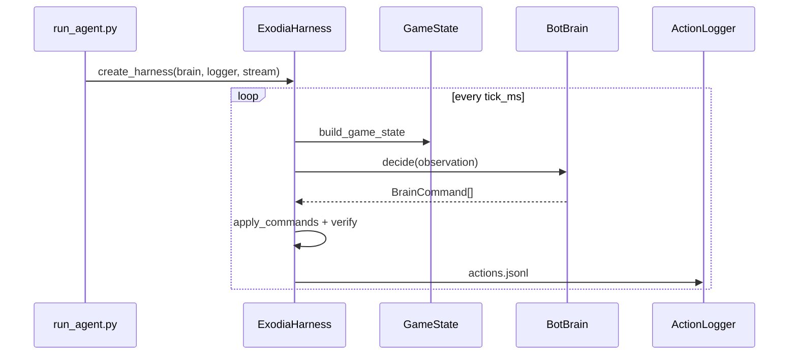

# Exodia

Python automation harness for **RuneLite** (OSRS): capture the client window, interpret the screen with OpenCV/Tesseract, and drive mouse/keyboard. The layout is intentionally split so you can hang an **agent** (LLM, planner, or scripted policy) off a single decision API.

**Architecture graph:** [`FUNCTIONS.md`](FUNCTIONS.md) (call edges, recipes) + [`FILES.md`](FILES.md) (file/import graph).

## Mental model

| Piece | Module | Role |
|--------|--------|------|
| **Client** (window anchor) | `bot_client.py` | Find RuneLite, track `win_rect`, refresh geometry (Win32 or Linux `xdotool`). On Linux, snap resize for stable vision. |
| **Eyes** | `bot_eyes.py` | Screenshots, ROIs, template/color clustering, OCR (`get_action_text`, `locate_*`). |
| **Arms** | `bot_arms.py` | Mouse/keyboard: smooth moves, clicks, **`drag_at`**, camera pans. On WSL (`wsl_ps`), paths use single-call linear smoothstep moves — not Bezier, not teleport. |
| **Inventory detect** | `bot_inventory_detect.py` | Outline template match → panel rect; 4×7 grid; slot occupancy (count items, not identity). |
| **Inventory items** | `bot_inventory_items.py` | Per-slot template match against `items/*.png`; known name or `?` if no match. |
| **Game state** | `bot_gamestate.py` | `GameState` dataclass + `build_game_state()` from `BotEyes` (OCR, inventory occupancy). |
| **Frames** | `bot_frames.py` | Per-tick PNG sidecar writer (world, inventory, action/chat strips). |
| **Stream** | `bot_stream.py` | MJPEG HTTP (`/stream/*`, `/snapshot/pristine`, `/meta` with nested inventory/world perception). |
| **Capture** | `bot_capture.py` | Decoupled `CaptureProducer` + `VisionProcessor` @ ≥2× OSRS tick rate. |
| **Track** | `bot_track.py` | Playspace blob motion + centroid IDs (v1). |
| **Action log** | `bot_action_log.py` | Always-on JSONL + plain-text action log per run. |
| **Verify** | `bot_verify.py` | Post-action diff of `GameState` snapshots. |
| **Session** | `bot_session.py` | Optional per-tick PNG + JSON replay (`--session`). |
| **Calibration** | `bot_calibration.py` | Startup health checks (capture, inventory template). |
| **Wait / poll** | `bot_wait.py` | `poll_until()` — generic timed condition polling (injectable sleep/stop). |
| **Action strip UI** | `bot_action_ui.py` | Tri-state action line (0/1/2), predicates, `wait_for_action_code()`. |
| **Playspace search** | `bot_search.py` | `playspace_search_roi()`, `search_with_camera_pan()`, `click_random_hit()`. |
| **World objects** | `bot_world_objects.py` | Playspace template match outside inventory (infernal eel spot icon); ROI + filter + dedupe glue. |
| **Spot verification** | `bot_spot_verify.py` | Sacred eel spot template + eel icon + cyan RuneLite outline checks. |
| **Session events** | `bot_session_events.py` | Per-run JSONL at `logs/<script_id>_events.jsonl`; `log_event()`; disable with `EXODIA_EVENTS=0`. |
| **Perception status** | `bot_perception_status.py` | `perception_status_from_eyes()` — capture mean, inventory calibration, action code for `runtime_status.json`. |
| **Runtime control** | `bot_runtime.py`, `exodia_ctl.py` | Poll `logs/runtime_control.json`, publish `logs/runtime_status.json` each tick; `python exodia_ctl.py <cmd>`. |
| **Agent (“brain”) + runtime** | `bot_harness.py` | `BotBrain` → `BrainCommand`s → `ExodiaHarness.step()`. |
| **Legs** | `bot_legs.py` | Timed loop: `update_all()` on mods, then `run_tasks()`. |
| **Runner** | `run_agent.py` | Canonical agent entrypoint. |
| **Desktop UI** | `ExodiaBotUI/` | Electron control shell — debug vision, calibration, spec-driven agent launcher. |

**Glue:** `bot_actions.py` — `bot_init`, `bot_update`, composites like `scan_for`, `click_on_image`, `use_item_on`.

Low-level capture/helpers live in **`bot_env.py`**. Linux window helpers in **`window_tool.py`**.

### GameState fields

| Field | Meaning |
|-------|---------|
| `action_busy` | `True` when action line is green (skill in progress) |
| `action_line_text` | OCR text from action strip |
| `dialogue_text` | OCR from chat strip |
| `inventory_occupied` | 4×7 bool grid (`True` = item present) |
| `inventory_item_count` | Count of occupied slots |
| `inventory_calibrated` | Inventory template matched |
| `capture_backend` | Active capture backend label |
| `frame_paths` | Optional sidecar PNG paths when `--session` |

## Agent quickstart

```bash
cd Exodia
pip install -r requirements.txt   # or requirements-linux.txt on WSL

# Run reference infernal fishing brain (tick-aligned, action log always on)
python run_agent.py --brain reference_fishing

# With MJPEG stream + optional session sidecars
python run_agent.py --brain reference_fishing --stream-port 8765 --session
```

Open `http://127.0.0.1:8765/` for stream index; `http://127.0.0.1:8765/stream/playspace_blobs` for motion overlay; `/meta` for capture/vision seq lag.

Capture runs on a **separate timer** (default 4 FPS, ≥2× the 600 ms OSRS tick). Vision (`bot_track`) runs in `VisionProcessor`; the harness tick only reads the latest buffer + cache.

### CLI flags (`run_agent.py`)

| Flag | Default | Purpose |
|------|---------|---------|
| `--brain` | `reference_fishing` | `reference_fishing` or `idle` |
| `--stream-port` | `8765` (`0`=off) | MJPEG HTTP port |
| `--log-dir` | `logs` | Action log root |
| `--tick-ms` | `600` | Loop interval (OSRS tick) |
| `--session` | off | Write PNG sidecars to `sessions/` |
| `--max-ms` | `0` | Wall-clock cap (ms) |
| `--debug` | off | BotEyes debug |

### Environment variables

| Variable | Purpose |
|----------|---------|
| `EXODIA_LOG_DIR` | Action log root (default `logs/`) |
| `EXODIA_STREAM_PORT` | MJPEG port (default `8765`, `0`=disabled) |
| `EXODIA_CAPTURE_STREAM` | `1` / `0` — enable buffer pipeline (auto when `--stream-port` > 0) |
| `EXODIA_CAPTURE_FPS` | Capture timer rate (default `4`, min ~3.3 = 2× OSRS tick) |
| `EXODIA_VISION_FPS` | Vision thread cap (`0` = match capture) |
| `EXODIA_CAPTURE_STALE_MS` | Sync-grab fallback if buffer older than this (default `600`) |
| `EXODIA_CAPTURE_BACKEND` | `mss`, `pil`, or `wsl_ps` (WSLg black-frame fix) |
| `EXODIA_INPUT_BACKEND` | `wsl_ps` (Windows mouse via PowerShell) or `pyautogui`. **Use `wsl_ps` when RuneLite runs on Windows from WSL** — set automatically by `tests/bot_inventory_test.py --online`. |
| `EXODIA_CAMERA_ROTATE` | `keys` (arrow keys, default) or `drag` (middle-mouse pan) |
| `EXODIA_CAMERA_KEY_HOLD_MIN_MS` / `_MAX_MS` | Random arrow hold per pan (default `300`–`900` ms) |
| `EXODIA_CAMERA_KEY_HOLD_MS` | Fixed hold ms (overrides random range) |
| `EXODIA_CAMERA_KEY_TAPS` | Optional multiplier on hold ms (legacy) |
| `EXODIA_TESSERACT_CMD` | Path to tesseract binary |
| `EXODIA_SIGNIFICANCE_MAX_SKIPS` | Stall escape for significance gate |

## Stream + action frame contract

When **`EXODIA_STREAM_PORT`** is set (or capture stream is on), **action subprocesses** (`bot_chain` handlers from ExodiaBotUI) use the perception MJPEG service for frames and cached vision — not a competing sync **`wsl_ps`** grab on each click.

| Piece | Source | Role |
|--------|--------|------|
| Pristine frame | HTTP `/snapshot/pristine` + **`/snapshot/pristine_meta.json`** | `StreamFrameMeta`: `capture_seq`, size, `frame_age_ms`, `source` |
| Perception | **`/meta`** | Nested `perception.inventory` (occupancy, `slot_items`, `inventory_rect`, …) and `perception.world` (`hits`, …) |
| Overlay scale | **`/meta`** → `overlay_max_width` | Debug/action overlay width (must match UI stream max width) |

**Dual vision on the stream:** `InventoryVisionProcessor` and `WorldVisionProcessor` run in parallel on the capture buffer (standalone `exodia_perception_stream.py` or harness publisher). Inventory thread fills the inventory slice; world thread fills `hits` for templates in **`EXODIA_WORLD_TEMPLATES`** (default `osrs_infernalEel`). Templates **not** in that list are not cached — `bot_chain` falls back to **live** playspace match (`live_match` / `live_identify`).

**Action wiring:** `bot_stream_client.refresh_action_frame` (or `fetch_stream_snapshot` → `apply_stream_snapshot_to_eyes`) → template click uses `world_hit_for_template` (world) or cached slot grid (inventory). `perception_source` in action JSON: `stream_cache` vs `live_match` / `live_identify`. **`bot_init` skips the initial `capture_frame` when stream is expected** — the first frame comes from `refresh_action_frame` at dispatch.

**Debug frame (`exodia_debug_frame.py`):** recovery only. When the stream snapshot is fresh, the script refuses to run (UI Refresh invalidates stream cache instead). Pass `--force-sync` for an explicit sync grab when the perception service is down.

Set **`EXODIA_DEBUG_FRAME_MAX_WIDTH`** to the same value as **Stream max width** in ExodiaBotUI (Electron sets it from `streamMaxWidth`). Mismatch scales debug overlays vs action coordinates.

| Error | Meaning | Typical fix |
|-------|---------|-------------|
| `stream_frame_unavailable` | No pristine JPEG or frame sidecar | Restart perception stream |
| `stream_meta_stale` | Pristine frame older than freshness threshold | Hard reset stream (UI uses `capture_seq` health, not blind reset every action) |

| Variable | Default | Purpose |
|----------|---------|---------|
| `EXODIA_MATCH_MAX_FRAME_AGE_MS` | `500` | Re-fetch pristine before click actions (world, inv, use-on) if frame is older |
| `EXODIA_STREAM_IDENTIFY_WAIT_MS` | `800` | Poll for inventory identify on stream before live fallback |
| `EXODIA_WORLD_VISION_FPS` | `2` | World vision thread rate (0.5–15) |

See [`FUNCTIONS.md`](FUNCTIONS.md) recipe *Run template action against stream cache* and [`bot_stream_client.py`](bot_stream_client.py).

## Action log review

Every `run_agent.py` run writes:

```
logs/<run_id>/actions.jsonl   # one JSON object per tick
logs/<run_id>/actions.log     # human-readable tail
logs/<run_id>/run_meta.json   # run summary on shutdown
```

Example plain-text line:

```
tick=42 | CLICK infernal_eel_fish.png | action=Idle | verify=changed
```

Query JSONL:

```bash
jq -r '.commands[].type' logs/*/actions.jsonl | sort | uniq -c
jq 'select(.verify.changed==true)' logs/*/actions.jsonl
```

## BrainCommand types

| Command | Effect |
|---------|--------|
| `CmdClickImage(template)` | Template match + click in playspace |
| `CmdClickColor(bgr, range=20)` | Color cluster click |
| `CmdUseItemOn(a, b)` | Inventory use-item-on |
| `CmdWaitTicks(n)` | Sleep `n * OSRS_TICK_S` seconds |
| `CmdWait(seconds)` | Sleep fixed seconds |
| `CmdLog(message)` | Print + capture in action log |

## How data flows

### Agent path (recommended)



Queue harness ticks via `BotLegs`:

```python
from bot_harness import create_harness, HarnessStepper
import bot_legs as Legs

h = create_harness(brain=...)
stepper = HarnessStepper(h)
legs = Legs.BotLegs(mods=[h.client, h.eyes])
legs._t = 600
legs.add_task(stepper, "tick", [])
legs.bot_loop()
```

### Legacy skill scripts

Scripts call `bot_actions.bot_init()` → `[client, eyes, arms]`, then loop with direct `eyes` / `arms` calls. **No `BotBrain`** unless you use a harness.

## Reference agents

| Module | Description |
|--------|-------------|
| `agents/reference_fishing_brain.py` | Infernal eel fishing + Imcando hammer cracking |

Required PNG templates (place in repo root or `images/`):

- `infernal_eel_fish.png` — fishing spot / inventory eel icon
- `imcando_hammer.png` — hammer for cracking
- `images/ui_icons.png` — inventory panel calibration (recommended)

## Tests

All automated tests live under **`tests/`**. Offline unit tests need no game client:

```bash
python tests/run_tests.py
# or:
python -m unittest discover -s tests -p '*_test.py' -v
```

### Inventory integration tests

Two suites — **eyes** (vision) and **arms** (mouse input), run separately.

| Suite | Command | What it tests |
|-------|---------|---------------|
| Eyes | `python tests/bot_inventory_test.py` | Outline match, occupancy grid, template identify |
| Eyes (live) | `python tests/bot_inventory_test.py --online` | Same, on a live capture — **no mouse input** |
| Arms | `python tests/bot_inventory_arms_test.py --online` | Drag occupied → empty slot; verify occupancy moved |
| Use-on | `python tests/bot_inventory_use_on_test.py --online` | Hammer → closest infernal eel (`items/hammer`, `items/infernal_eel`) |

`tests/run_tests.py` runs eyes (offline) only; arms are skipped unless you invoke the arms script.

**Eyes** (`tests/bot_inventory_test.py`):

1. **find inventory** — outline template match + grid validation  
2. **count items** — 4×7 occupancy grid (0–28 occupied slots)  
3. **identify items** — template match each occupied slot against `items/*.png`; label `?` when unknown  

**Arms** (`tests/bot_inventory_arms_test.py`, online only):

1. **drag item** — random occupied → random empty via `BotArms.drag_at`; mouse returns to **screen center** before captures  
2. **drag rounds** — optional extra drags when `EXODIA_INV_DRAG_ROUNDS` > 1  

**Use-on** (`tests/bot_inventory_use_on_test.py`, online only):

1. **hammer → eel** — identify slots via `items/*.png`; click source then **closest** matching eel slot  
2. Skips when hammer or eel not visible; env: `EXODIA_USE_ON_SOURCE`, `EXODIA_USE_ON_DEST`, `EXODIA_USE_ON_SETTLE_S`  

Outputs (local, gitignored except committed templates):

| File | When |
|------|------|
| `captures/inventory_test_overlay.png` | Eyes suite |
| `captures/offline_inventory_detect.png` | Eyes offline only |
| `captures/inventory_arms_overlay.png` | Arms suite |
| `captures/inventory_use_on_overlay.png` | Use-on suite |
| `captures/world_detect_overlay.png` | World object eyes suite |

### World object integration tests

Eyes-only suite for **playspace** template match (not inventory). Default template: **`captures/osrs_infernalEel.png`**.

| Suite | Command | What it tests |
|-------|---------|---------------|
| Eyes (offline) | `python tests/bot_world_detect_test.py` | ROI, match pipeline, overlay — structural (0 hits OK on inventory fixture) |
| Eyes (live) | `python tests/bot_world_detect_test.py --live` | Same on live RuneLite capture; expects ≥1 hit by default |

Override offline frame: `EXODIA_WORLD_OFFLINE_IMAGE=captures/live_probe_now.png python tests/bot_world_detect_test.py`

Useful env overrides:

| Variable | Purpose |
|----------|---------|
| `EXODIA_WORLD_TEMPLATES` | Comma-separated capture stems (default `osrs_infernalEel`) |
| `EXODIA_WORLD_TEST_LIVE` | `1` when using `--live` (set by script) |
| `EXODIA_WORLD_OFFLINE_IMAGE` | Offline PNG path (default: inventory reference fixture) |
| `EXODIA_WORLD_MIN_HITS` | Live run: min hits required (default `1`; set `0` for structural-only live) |
| `EXODIA_WORLD_THRESHOLD` | World icon match threshold inside cyan window (default `0.65`) |
| `EXODIA_WORLD_CYAN_FIRST` | Find cyan tile markers first, then match icon above (default on) |
| `EXODIA_WORLD_CYAN_FALLBACK` | Full playspace template scan when cyan path finds nothing (default off) |
| `EXODIA_WORLD_ICON_PAD_X` / `_PAD_ABOVE` / `_PAD_BELOW` | Icon search padding around cyan tile box (default `30` / `70` / `30`) |
| `EXODIA_WORLD_CYAN_MIN_AREA` / `_MAX_AREA` / `_MAX_SIDE` / `_MIN_SIDE` | Cyan blob size filters (default min side `12`) |
| `EXODIA_WORLD_CYAN_SPLIT_MIN_W` / `_TILE_W` | Split merged wide blobs into tile-sized segments (default `72` / `56`) |
| `EXODIA_WORLD_CYAN_MAX_ROI_FRAC` | Reject blobs spanning more than this fraction of search ROI (default `0.12`) |
| `EXODIA_WORLD_SCORE_MARGIN` | Legacy full-scan weak-peak drop (only when cyan fallback runs) |
| `EXODIA_CAPTURES_DIR` | Template + overlay directory (default `captures/`) |
| `EXODIA_SPOT_DEDUPE_RADIUS` | Dedupe radius px (default `28`) |

Item templates: add cropped slot PNGs to **`items/`** (filename stem = item name, e.g. `flax.png` → `"flax"`). Matching uses the **full slot tile** (50×45) so `matchTemplate` can align icons that sit slightly off-center; occupancy still uses the inset crop.

**Label unknown items interactively:**

```bash
cd Exodia && .venv/bin/python3 label_inventory_item.py
```

Click a slot or pick a fingerprint bucket in the sidebar, then **Label bucket…** / **Label slot…** to save `items/<name>.png` and re-identify. Non-interactive: `--name flax --slot 0,0` or `--name flax --bucket tmp:a1b2c3d4`. Requires `client_rect.json` and a graphical display (WSLg) for the GUI.

Useful env overrides:

| Variable | Purpose |
|----------|---------|
| `EXODIA_ITEMS_DIR` | Item template directory (default `items/`) |
| `EXO_INV_THR` | Inventory template click/Find min score (default `0.35`; legacy `EXODIA_INV_TEMPLATE_THRESHOLD`) |
| `EXO_INV_ID_THR` | Slot identify / catalog min score (default `0.40`; legacy `EXODIA_INV_ITEM_MATCH_THRESHOLD`) |
| `EXO_INV_INSET` | Slot crop inset for item match (default `0`; legacy `EXODIA_INV_ITEM_MATCH_INSET`) |
| `EXODIA_INV_FRAME_BUCKETS` | Group unknown slots into ephemeral `tmp:<id>` buckets (default `0`; on in inventory tests + labeler) |
| `EXODIA_BUCKET_TEMPLATE_MIN` | Cross-slot template threshold for tolerant bucketing (default `0.38`) |
| `EXODIA_BUCKET_USE_SEEN_LOOSE` | Enable loose dHash+hue tier for bucketing (default `1` in labeler) |
| `EXODIA_SEEN_ITEMS` | Register/match temp `unknown:<8-hex>` ids (default `0`; set `1` for manual runs) |
| `EXODIA_MATCH_DEBUG` | Rejection lines in inventory test overlay |
| `EXODIA_INV_DRAG_FROM` / `EXODIA_INV_DRAG_TO` | Force slot `row,col` instead of random pick (arms suite) |
| `EXODIA_INV_DRAG_ROUNDS` | Arms: consecutive drags (default `1`; round 2+ in `test_drag_multiple_rounds`) |
| `EXODIA_INV_DRAG_SETTLE_S` | Wait after drag before re-capture (default `1.0`) |
| `EXODIA_INV_HOVER_CLEAR_S` | Wait after moving mouse to center (default `0.35`) |
| `EXODIA_WSL_MOVE_MS_MIN` / `_MAX` | WSL move duration bounds (default `110`–`260` ms) |

Other live scripts:

```bash
python tests/test_stream_live.py --seconds 30
```

Manual smoke scripts (game required, not unittest): **`tests/manual/`**.

## PNG / screenshot safety

Live captures can show **username, chat, friends, inventory contents**, etc. **Do not commit client screenshots.**

| Policy | Detail |
|--------|--------|
| `.gitignore` | All `*.png` ignored except **`captures/osrs_inventory_base.png`** (static inventory frame template) and **`items/*.png`** (item icon templates — no account info) |
| `captures/` | Overlays, test output, calibrations, world templates (e.g. **`osrs_infernalEel.png`**) — local only |
| `tests/fixtures/**/*.png` | Offline reference captures — local only |
| Pre-commit hook | From repo root (`Botting/`): `git config core.hooksPath githooks` — blocks **new** PNG paths except allowlisted template + `items/*.png` |

Legacy template PNGs under `images/` remain tracked from before this policy; do not add new unreviewed PNGs.

## Setup

From the `Exodia` directory:

```bash
pip install -r requirements.txt
```

**Windows:** uses **pywin32** for window targeting (see `bot_client.py`).

**Linux / WSLg:** use `requirements-minimal.txt` (Python 3.12+) and install **tesseract-ocr**, **xdotool**, **python3-tk**. Set `EXODIA_TESSERACT_CMD` if needed. Use **`EXODIA_CAPTURE_BACKEND=wsl_ps`** when `mss` returns black frames.

### Desktop app (`ExodiaBotUI`)

Graphical control shell for calibration, inventory debug overlays, and a spec-driven agent launcher. Requires the same Python setup as above plus **Node.js 20+**.

```bash
cd Exodia/ExodiaBotUI
npm install
npm run dev
```

This starts Vite with HMR and launches Electron when the dev server is ready.

**First run checklist:**

1. **File → Preferences…** (`Ctrl+,`) — confirm **Exodia root** and **Python path** (defaults to `{exodiaRoot}/exodia/bin/python` if present, else `python3`; set to `.venv/bin/python` if you use a local venv). Set **Scripts folder** to where your markdown task specs live (e.g. `PlansTODO/`).
2. **Run smoke test** in Preferences — should print `ok` in the Log panel.
3. **Calibrate** — RuneLite view → **Calibrate**, or **Preferences → Calibrate client rect** (runs `calibrate_client_rect.py` and opens the ROI picker).
4. **Refresh** — RuneLite view → **Refresh** or **View → Refresh debug frame** (`F5`) to capture the client and show inventory detect/identify overlays.
5. **Load a task spec** — **Scripts → Specs** (markdown files only) → select a `.md` file → **Load into Bots**.
6. **Start agent** — **Scripts → Bots** → **Start agent** (runs `run_agent.py` with `--spec` for each loaded file). Logs stream to the Log panel; use **Bot → Stop/Pause/Resume** while running.

Agent with specs from the CLI:

```bash
python run_agent.py --brain reference_fishing --spec PlansTODO/my_task.md
```

Production build (packaging later):

```bash
cd Exodia/ExodiaBotUI
npm run build
```

**WSL / Linux:** GPU acceleration is disabled automatically if the window is blank. Open DevTools with `EXODIA_DEVTOOLS=1 npm run dev`. More UI details: [`ExodiaBotUI/README.md`](ExodiaBotUI/README.md).

### WSL + Windows RuneLite (recommended if RuneLite runs on Windows)

WSL cannot see Windows windows via `xdotool`. Calibrate once so the bot knows where RuneLite is on your Windows desktop:

```bash
cd Exodia && source exodia/bin/activate
python calibrate_client_rect.py    # tkinter ROI picker (not OpenCV — headless build)
python -m SacredEelFishing.sacred_eel_fishing       # loads Exodia/client_rect.json automatically
```

Session output is tee'd to **`Exodia/logs/sacred_eel_latest.log`** (truncated each run). Tail while running:

```bash
tail -f Exodia/logs/sacred_eel_latest.log
```

Override with `--log-file PATH` or `EXODIA_SACRED_EEL_LOG`.

If the GUI cannot open (no WSLg display), open `captures/calibrate_primary.png` on Windows and run:

```bash
python calibrate_client_rect.py --rect LEFT,TOP,WIDTH,HEIGHT
```

Or pass coords without saving:

```bash
python -m SacredEelFishing.sacred_eel_fishing --rect LEFT,TOP,WIDTH,HEIGHT
```

### Infernal eel fishing

Fish infernal eels at spot templates; crack with Imcando hammer when inventory is **28/28** full. Eel and hammer must be labeled in `items/` (defaults: `infernal_eel`, `hammer` — use `label_inventory_item.py`).

```bash
cd Exodia && source exodia/bin/activate
python calibrate_client_rect.py    # once, if using Windows RuneLite from WSL
python -m InfernalEelFishing.infernal_eel_fishing
# or: ./InfernalEelFishing/run_infernal_eel.sh
# diagnose (no clicks): ./InfernalEelFishing/run_infernal_eel.sh diagnose
```

Session log: **`Exodia/logs/infernal_eel_latest.log`**. Item labels: `EXODIA_INFERNAL_EEL_ITEM`, `EXODIA_INFERNAL_HAMMER_ITEM`. Spot templates: `EXODIA_INFERNAL_SPOT_TEMPLATES` (default `infernal_eel_spot.png` under `images/`).

**World spot icon (playspace detect test):** template **`captures/osrs_infernalEel.png`**; run `python tests/bot_world_detect_test.py --live` and inspect **`captures/world_detect_overlay.png`**. Tune **`EXODIA_WORLD_THRESHOLD`** (default `0.65`) if hits are missed or lava sparks false-positive.

When a manual rect is used, capture and mouse input default to **`wsl_ps`** (Windows screen + clicks via PowerShell) if `/mnt/c/Windows/.../powershell.exe` exists. Override with `EXODIA_CAPTURE_BACKEND` / `EXODIA_INPUT_BACKEND`.

Environment alternatives:

| Variable | Purpose |
|----------|---------|
| `EXODIA_CLIENT_RECT` | `LEFT,TOP,WIDTH,HEIGHT` without a JSON file |
| `EXODIA_CLIENT_RECT_FILE` | Path to saved rect JSON (default: `Exodia/client_rect.json`) |
| `EXODIA_SPOT_PAN_ATTEMPTS` | Camera pans while seeking a spot (default `8`) |
| `EXODIA_SPOT_WALK_ATTEMPTS` | Ground clicks to walk after pans fail (default `4`, N/E/S/W) |
| `EXODIA_WALK_WAIT_S` | Seconds to wait after each walk click (default `3`) |
| `EXODIA_SPOT_THRESHOLD` | Sacred spot template threshold (default `0.45`) |
| `EXODIA_SPOT_TRUST_TEMPLATE` | Use strong template match when eel/cyan fail (`0` = off; default ~`0.48`) |
| `EXODIA_SPOT_EEL_THRESHOLD` / `EXODIA_SPOT_CYAN_MIN_RATIO` | Spot verify gates (defaults `0.38` / `0.012`) |
| `EXODIA_MAX_CYCLES` | FSM steps before stop (`30` default; `0` = unlimited) |
| `EXODIA_ACTION_STRIP_RECT` | Manual action-line ROI `LEFT,TOP,WIDTH,HEIGHT` (client-local) |
| `EXODIA_ACTION_STRIP_LEFT_OF_INV` | Place action ROI left of inventory (`1` default) |
| `EXODIA_ACTION_STRIP_WIDTH` / `_HEIGHT` / `_GAP` / `_Y_FRAC` | Tune left-of-inv crop (defaults `140`×`42`, gap `6`, y `0.10`) |

**UI regions (`bot_eyes` / `bot_inventory_detect` / `bot_inventory_items` / `bot_match_index`):** inventory panel via **`captures/osrs_inventory_base.png`** outline match (or `EXODIA_INV_OUTLINE_TEMPLATE`). Grid layout env: **`EXODIA_INV_GRID_OFFSET`**, **`EXODIA_INV_TILE`**, **`EXODIA_INV_TILE_GAP`**. Occupancy tuning: **`EXODIA_INV_CELL_STD_THRESHOLD`**, **`EXODIA_INV_EMPTY_BGR_MAX_DELTA`**, **`EXODIA_INV_CELL_INSET`**. Item identity: templates in **`items/`** (named + optional 8-char temp ids), gated match via **`bot_match_index`**, **`EXODIA_INV_ITEM_MATCH_THRESHOLD`**, **`EXODIA_SEEN_ITEMS`**, **`EXODIA_MATCH_STACK_MASK`**. Run **`python tests/bot_inventory_test.py`** for **`captures/inventory_test_overlay.png`**; with **`EXODIA_SEEN_ITEMS=1`**, unknown slots become **`unknown:<8-hex>`** and persist under **`items/`**. Cleanup: **`python -m bot_match_index cleanup --dry-run`**. Legacy **`images/ui_icons.png`** path still exists on `BotEyes.find_inventory()`. **`perception_envelope`** carries **`inventory_slot_occupancy`** (4×7 booleans). Set **`EXODIA_MASK_PANELS=0`** to skip UI blackout on `curr_client`.

## Legacy example scripts

Historical one-offs live under **`legacyCode/`** (not canonical entrypoints). See [`legacyCode/README.md`](legacyCode/README.md).

| Script | Notes |
|--------|--------|
| `legacyCode/infernal_fishing.py` | **Deprecated** — redirects to `InfernalEelFishing.infernal_eel_fishing` |
| `legacyCode/agility.py` | Color-based course sequence |
| `legacyCode/WhyFletch.py` | Fixed-coordinate clicks |

## Related notes elsewhere in the repo

Older docs under `../Corpus/` may mention `bot_brain` for the old window finder — that code is **`ClientWindow`** (`bot_client.py`). **`BotBrain`** here means *the agent / policy*.
